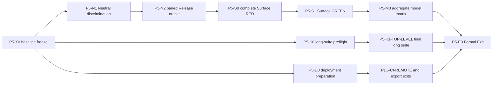

# P5 Formal Exit execution plan

- Status: `APPROVED / GOVERNING`
- Decision date: 2026-08-19
- Governing records:
  [program intent](vulkan-program-intent-framework.md),
  [development report](vulkan-compute-acceleration-development-report.md), and
  [status board](vulkan-compute-acceleration-status.md)

## 1. Purpose and approved decisions

This document is the single execution plan for the remaining P5 closeout.
Current and future P5 closeout work must follow its dependency order, task-card
boundaries, sub-agent rules, acceptance gates, and cleanup policy. A narrow
local smoke, an executor callback, or a CPU fallback row must not be promoted
into a broader completion claim.

The user confirmed all three recommended decisions on 2026-08-19:

1. **Formal-exit scope is authoritative.** P5 closes only after functional
   closure, aggregate model classification, the long top-level gate,
   install/export and deployment evidence, hosted CI evidence, support-matrix
   publication, and final cleanup. Verified CPU fallback is an accepted row
   outcome; it is not silently described as Vulkan support. Optional or
   external lanes such as VTK and a self-hosted Vulkan runner must either pass
   or remain explicitly classified. They are never converted to `PASS` by
   omission.
2. **Isolated repair candidates are authorized.** An isolated worktree may
   test supported MSVC/LLVM OpenMP combinations and ViennaCore repair or pin
   candidates while retaining `/O2 /Ob2 /DNDEBUG /openmp:llvm /MD /Zi` and
   unmodified CPU physics. No dependency or toolchain candidate becomes a
   production default until the paired reference/Mod oracle passes and the
   main line accepts the change.
3. **A closeout checkpoint is authorized.** After reviewing the existing dirty
   tree, the main line may create the `codex/p5-closeout-base` checkpoint. New
   implementation cards must branch or create worktrees from that verified
   checkpoint rather than reconstructing the current P5 diff ad hoc.

## 2. Canonical terms and completion rule

**P5 Functional Closure** means every P5 functional and model row has a proven
eligible Vulkan route or an explicit, verified CPU fallback/unsupported
classification. It includes the Release Neutral CPU oracle, complete surface
Process acceptance, and the aggregate model matrix.

**P5 Formal Exit** means P5 Functional Closure plus the release-facing
deployment, install/export, hosted-CI, support-matrix, long-test, record and
cleanup gates. Only P5 Formal Exit permits the plan to advance to P6/P7.

P5 completion does not require every ViennaPS model to execute on Vulkan. It
requires accurate support claims, CPU-authoritative semantics, safe fallback,
transactional publication and evidence matching each claimed route.

## 3. Verified starting state

The planning audit on 2026-08-19 found:

- the main worktree has 116 status entries: 44 modified and 72 untracked;
- Git records ten worktrees: the main tree and five secondary trees are dirty,
  while four secondary trees are clean cleanup candidates;
- the repository root contains no `build`, `.build`, root `build-*`, or
  `.tmp_*` directory;
- the process-name audit found no running CMake, CTest, compiler, linker,
  MSBuild, Ninja, or ViennaPS smoke executable;
- dirty worktrees and untracked P5 production/test assets are user work and
  must not be deleted or staged implicitly.

This state makes baseline consolidation the first executable dependency. A
sub-agent must not begin a production edit before the checkpoint is reviewed.

## 4. Invariants

1. The unmodified ViennaPS CPU flow and
   `D:\Codex_lib\code_reference\ViennaPS` remain the semantic authority.
2. Vulkan replaces only an admitted compute operation. `Process`,
   `FluxProcessStrategy`, model chemistry, callback/RNG order, Level Set
   ownership and host publication remain CPU-controlled unless a separate
   accepted card says otherwise.
3. Every candidate output is staged. Status, shape, finite values, session
   generation and oracle conditions are checked before publication.
4. Automatic policy falls back to CPU at the accepted boundary. A Manual
   Vulkan request fails closed without partial flux, coverage, metadata or
   geometry publication.
5. A support row is opt-in and predicate-bound. CUDA support, a callback seam,
   configuration success, or an internal CPU oracle is not Vulkan evidence.
6. The main line alone changes a card to `DONE`, integrates its diff, fixes a
   reclaimed card, updates the status board, and makes release claims.
7. Implementation cards use one registered Git worktree and keep build output
   in that worktree's `.build` directory. Root `build-*` directories are
   prohibited.

## 5. Dependency graph



Only read-only preparation or diagnostic runtime work may run ahead of a
predecessor. A downstream implementation or completion-state update must wait
for its incoming gate.

## 6. Executable task cards

### P5-X0-CLOSEOUT-BASELINE

- **Milestone:** produce a reviewable baseline for all remaining P5 work.
- **Owner:** main line; no delegated production edit.
- **Predecessor:** approved plan and decisions in Section 1.
- **Owned records:** worktree/diff manifest, checkpoint branch and closeout
  board entries only.
- **Ordered exits:** classify all current modifications; map every registered
  worktree to a branch, owner and retained diff; verify no active process uses a
  candidate cleanup target; review the aggregate P5 diff; create
  `codex/p5-closeout-base`; verify a clean closeout worktree can configure.
- **Acceptance:** no user change is lost, no unrelated file is staged, and the
  checkpoint contains the exact reviewed P5 baseline.
- **Next unlock:** `P5-N1`, `P5-K0`, and `P5-D0`.

### P5-X1-HYGIENE-CLEANUP

- **Milestone:** remove obsolete build/test environments without deleting
  evidence or active card work.
- **Predecessor:** `P5-X0` manifest and checkpoint.
- **Owned scope:** only targets classified `CLEAN-SAFE` by the manifest.
- **Prohibited:** recursive deletion of the repository root, dirty worktrees,
  untracked P5 source/tests, dependency caches, or an unverified path.
- **Ordered exits:** resolve absolute path; confirm it is not the workspace
  root; check `git worktree list`; verify branch reachability and clean status;
  audit relevant processes; delete or prune the exact target; rerun worktree
  and process audits.
- **Acceptance:** retained worktrees remain usable and every deletion has an
  ownership/evidence record. Cleanup may run between waves but does not unlock
  a physics claim.

### P5-N1-NEUTRAL-ROOTCAUSE-DISCRIMINATION

- **Milestone:** identify a safe external/toolchain repair boundary for the
  Release Neutral oracle.
- **Owner:** sub-agent A, `gpt-5.6-luna`, `xhigh`.
- **Predecessor:** `P5-X0` and the authorized candidate boundary.
- **Global position:** the existing pure-KDTree, synthetic mapping, real-mesh,
  CPUTriangle preflight and changed-code-generation probes already exhausted
  their diagnostic boundaries. This card must not repeat them. It holds the
  full failing fixture, flags, dependency identities and raw output contract
  fixed, and changes one external/toolchain dimension at a time.
- **Owned scope:** isolated toolchain/dependency overlays and the paired test
  runner. Production CPU formulas, the reference physics tree and Vulkan
  eligibility are prohibited.
- **Ordered exits:** freeze the current failing lane; test a supported MSVC and
  LLVM OpenMP closure; if still failing, test one independently reviewed
  ViennaCore candidate; require reference and Mod OMP=1 success before
  expanding the OMP matrix.
- **Acceptance:** a named root-cause category or a single candidate that lets
  both trees complete without changing the required flags or fixture.
- **Retry:** one named `RETRY_ONCE`; a repeated failure is reclaimed to the
  main line.
- **Next unlock:** `P5-N2` only.

### P5-N2-NEUTRAL-ORACLE-GREEN

- **Milestone:** close `P5-NEUTRAL-CPU-ORACLE`.
- **Owner:** reuse sub-agent A with `followup_task`.
- **Predecessor:** main-line acceptance of the `P5-N1` candidate.
- **Owned scope:** the minimal candidate adoption and independent paired
  runner. A production pin/patch is staged but not accepted automatically.
- **Acceptance matrix:** Mod and unmodified reference, OMP 1/2/4/8, exact
  Release flags, identical dependency/runtime closure, exit 0, raw serialized
  process/flux/coverage/geometry equality, no SEH exception, and reproducible
  commands.
- **Main-line gate:** rebuild both sides independently and rerun the full
  matrix before updating the board.
- **Next unlock:** `P5-S0` and `P5-NEUTRAL-VELOCITY-SUBSTAGE` evidence.

### P5-S0-SURFACE-ACCEPTANCE-RED

- **Milestone:** freeze one complete Process-level surface acceptance fixture.
- **Owner:** continue with sub-agent A to retain Neutral/oracle context.
- **Predecessor:** `P5-N2` accepted.
- **Owned scope:** a new focused fixture and narrow CMake/CTest registration.
  No production behavior changes are allowed until RED is deterministic.
- **Required observations:** coverage initialization; source/desorption flux;
  flux and coverage diffusion; Neutral coverage/sticking/desorption state;
  neutral velocity; Level Set advection; process time/result/metadata; callback
  order/count; flux, coverage, conservation and geometry outputs.
- **Negative scenarios:** Auto fallback; Manual fail-closed; incomplete output;
  malformed shape/status; NaN; reset; lost/stale session generation; copied
  callback lifetime; bytewise publication sentinels.
- **Acceptance:** CPU callback-free and shared-session Vulkan routes share the
  same fixture and the intended missing surface boundary is observable.
- **Next unlock:** `P5-S1`.

### P5-S1-SURFACE-INTEGRATION-GREEN

- **Milestone:** close the full surface Process boundary narrowly.
- **Owner:** reuse sub-agent A; main line accepts and fixes reclaimed issues.
- **Owned scope:** only the adapters required by `P5-S0`, plus its fixture.
- **Prohibited:** CPU formula/order changes, a second Process loop, model-matrix
  expansion, shader callback/RNG interpretation, and automatic backend
  promotion.
- **Acceptance:** paired CPU reference evidence, Release Intel Arc
  `Process::calculateFlux()` and `Process::apply()` differential, flux and
  coverage conservation, geometry/time/metadata equality, shared session
  identity, failure rollback and all focused surface/ray regressions.
- **Next unlock:** `P5-M0`.

### P5-M0-MODEL-MATRIX-AGGREGATE

- **Milestone:** close the aggregate 15-row P5 support matrix.
- **Owner:** sub-agent B after `P5-S1`; read-only gap preparation may start
  earlier without editing a support row.
- **Invariant:** P5 closure does not require Vulkan execution for every row.
  Each row must state one of: admitted Vulkan route, exact CPU fallback, or
  explicit unsupported boundary.
- **Acceptance per row:** exact eligibility predicate, independent CPU
  differential, suitable conservation/geometry criterion, Auto/Manual
  behavior, unsupported reason, and no inferred CUDA-to-Vulkan support.
- **Aggregate acceptance:** the inventory, compute map, fallback smoke and
  support matrix agree on all rows; no broad Vulkan enable switch exists.
- **Next unlock:** `P5-K1-TOP-LEVEL` and release-facing support documentation.

### P5-K0/K1-TOP-LEVEL-GATE

- **Milestone:** expose long-suite failures early and accept the final P5
  candidate only after a clean full run.
- **Owner:** sub-agent C, reused for both cards.
- **K0 predecessor:** `P5-X0`; this run is diagnostic only.
- **K1 predecessor:** `P5-S1` and `P5-M0` accepted. The fully qualified card
  ID is `P5-K1-TOP-LEVEL`, to distinguish it from the historical strict-FP32
  policy seam also named `P5-K1` in the status report.
- **Ordered exits:** fresh canonical configuration; focused smoke cluster;
  non-benchmark triage if required; complete required top-level CTest on the
  final candidate; retain timeout/flaky classification and first failure;
  explicitly reap and audit descendants.
- **Acceptance:** final required suite passes with no orphaned compiler, CTest
  or Vulkan process. An early K0 pass does not substitute for K1.

### P5-D0/D1-DEPLOYMENT-EXIT

- **Milestone:** close release-facing local and remote evidence.
- **Owner:** a third sub-agent may prepare local evidence; remote writes remain
  main-line actions under separate execution authority.
- **Parallel boundary:** local install/export, profile persistence, workflow
  inspection and VTK packaging diagnosis do not change surface/model code and
  may run after `P5-X0`.
- **Local acceptance:** CPU/no-SDK and opt-in Vulkan payload producer/install/
  independent-consumer tests; profile serialize/provision/reload/stale checks;
  no absolute SDK/cache path in installed artifacts.
- **Remote acceptance:** publish the exact candidate; hosted path-hygiene,
  test and install-export jobs pass; record commit SHA, run IDs and URLs. A
  self-hosted Vulkan lane and VTK lane keep their explicit classifications.
- **Next unlock:** `P5-E0` after `P5-M0` and `P5-K1-TOP-LEVEL`.

### P5-E0-FINAL-AUDIT

- **Owner:** main line only.
- **Predecessors:** `P5-N2`, `P5-S1`, `P5-M0`, `P5-K1-TOP-LEVEL`, local deployment and
  hosted-CI gates.
- **Acceptance:** self-audit the complete diff; rerun focused CPU/Vulkan gates;
  verify the formal support matrix and Selection Records; update the intent,
  development report, status board and user-facing Preview boundary; clean
  accepted build/test/worktree artifacts; verify retained dirty work is
  unchanged.
- **Completion rule:** only this card may set `P5-DEPLOYMENT-EXIT` to `DONE`.

## 7. Sub-agent dispatch contract

### Capacity and model

- At most three sub-agents run concurrently; the main line occupies the fourth
  execution slot and acts as pipeline supervisor.
- Implementation and multi-step diagnostic cards use `gpt-5.6-luna` with
  `xhigh` reasoning as explicitly selected by the user.
- Initial dispatch uses `fork_turns=none`; the strong card carries the needed
  context and anchors. Consecutive work uses `followup_task` on the same agent.

### Mandatory strong-card fields

```yaml
card_id:
milestone:
predecessor_contract_and_evidence:
next_unlocked_milestone:
global_position: 100-200 tokens
invariants:
owned_files_and_interfaces:
prohibited_scope:
ordered_exits:
acceptance_scenario:
exact_validation_commands:
handoff_boundary:
retry_state:
```

Every worker is told that it is not alone in the codebase, must not revert
another owner's changes, and must adapt to accepted concurrent edits without
crossing its ownership boundary.

### Local validation mutex

The user amended the execution policy on 2026-08-19 after concurrent builds
exhausted the local runner. Up to three agents may still perform independent
read-only analysis or bounded edits, but local validation is globally
serialized. At most one card may run CMake configuration, compilation, CTest,
reference emitters, Vulkan executables, or another CPU/GPU-intensive workload
at a time. Other agents must stop at a documented `CHECKPOINT` until the main
line releases the validation lane. Batch or parallel validation is prohibited,
including validation in separate worktrees. The main line records lane owner,
start/finish, descendants reaped, and the next queued card before handoff.

### Retry and reclaim

Cards follow:

`READY -> RUNNING -> CHECKPOINT -> RETRY_ONCE -> DONE | RECLAIM`

One retry is allowed only for a named failure with a new evidence target. If
the same boundary fails again, the card is reclaimed with its diff, logs,
commands and unchecked items preserved. A second sub-agent must not repeat the
same task. The main line performs any further fix. A genuinely changed module,
toolchain/dependency boundary or acceptance product requires a new card.

### Handoff and main-line acceptance

Each handoff contains:

- changed and untracked files;
- exact configure/build/test commands and exit results;
- CPU/reference oracle and hardware identity;
- negative/fail-closed scenarios;
- diff-check result;
- residual risk and prohibited claims;
- cleanup state and active-process audit.

The main line independently checks the owned diff, reference boundary,
focused tests, affected regressions, Intel Arc evidence when required, and the
claim boundary. A sub-agent never marks the board `DONE` itself.

## 8. Execution waves

### Wave 0 — main-line baseline

Run `P5-X0`; classify cleanup targets; create and verify
`codex/p5-closeout-base`. Do not dispatch a production card before this exit.

### Wave 1 — critical root cause plus independent preparation

- Agent A: `P5-N1` and then `P5-N2`.
- Agent C: `P5-K0` diagnostic long-suite preflight.
- Third slot: `P5-D0` local deployment/VTK/CI preparation only.

The main line supervises and accepts checkpoints. Downstream surface/model
implementation remains locked.

### Wave 2 — complete surface boundary

- Reuse Agent A for `P5-S0` then `P5-S1`.
- Agent B may perform a read-only aggregate model gap audit.
- Deployment preparation may continue without remote mutation.

### Wave 3 — aggregate and final candidate

- Agent B completes `P5-M0` after `P5-S1`.
- Reuse Agent C for `P5-K1-TOP-LEVEL` on the integrated candidate.
- Complete local install/export and prepare the exact remote candidate.

### Wave 4 — remote evidence and final audit

The main line publishes the authorized candidate, records hosted evidence,
performs `P5-E0`, updates all records, and removes only verified cleanup
targets. P6 work stays locked until this wave completes.

## 9. Record-update rule

This plan is governing, not completion evidence. Task results remain in the
status board. The development report summarizes the active wave. The intent
document changes only if an architectural invariant changes. Records are
updated after main-line acceptance, never merely because code exists or a
sub-agent reports success.

## 10. Wave 0 baseline audit snapshot (2026-08-19)

`P5-X0` used three concurrent fast Luna/xhigh read-only cards for production,
records/tests, and worktree hygiene. This predates the validation mutex and did
not run concurrent build/test workloads. Main-line review accepted these
findings:

- the root contains accumulated accepted prerequisites and pending P5 work;
  the closeout baseline therefore snapshots the explicit source, test, build
  and governing-record set instead of trying to split historical intent by
  filename alone;
- `.claude/` and
  `tests/multibounceFrontierReferenceDifferential/.tmp_mod/` are generated or
  environment state and are excluded from the checkpoint;
- all ten registered worktree paths exist. Dirty worktrees are preserved, and
  the four clean worktrees with unique or disjoint commits remain unclassified;
  no worktree is an approved cleanup target in this wave;
- generated build trees remain unclassified and are not deleted. The process
  name audit found no active compiler, build, test or launcher process, while
  command-line inspection was unavailable and therefore cannot authorize
  destructive cleanup;
- the repository documentation link audit passed. The TEOS velocity board row
  now links its paired CPU fixture, and the project handoff guides use this
  governing execution order.

The baseline checkpoint is commit
`39e644082f5b007d05856dce1c6f96cb850e6209` on
`origin/codex/p5-closeout-base`. It was staged from an explicit 178-file list;
`.claude/`, the multibounce `.tmp_mod/` tree, and all generated validation
trees were absent from the commit. The author and committer use the GitHub
noreply address required by repository privacy protection.

Main-line validation used a detached clean worktree. GNU `patch --dry-run`
accepted `viennals-v5.8.5-levelset-update-v2.patch`; its single-space context
markers are unified-diff syntax and remain an intentional `diff --check`
exception. The following configuration completed successfully in 21.8 s plus
1.2 s generation time:

```powershell
$env:CPM_SOURCE_CACHE = 'D:\Codex_lib\ViennaPSMod\.cpm-cache'
pwsh -File cmake/invoke-cmake-clean-env.ps1 -S . \
  -B .tmp_p5_x0_config_novtk_<date> \
  -DVIENNAPS_ENABLE_VULKAN=ON -DVIENNAPS_USE_VTK=OFF \
  -DVIENNAPS_VTK_RENDERING=OFF -DVIENNAPS_BUILD_TESTS=OFF \
  -DVIENNAPS_BUILD_EXAMPLES=OFF
```

The VTK-enabled clean configuration reached generation but failed because
ViennaLS exports `ViennaLS` with VTK targets absent from its export set. This
is retained as the first `P5-D0` packaging boundary; it does not invalidate the
accepted CPU/no-SDK baseline. Wave 0 is complete and Wave 1 is unlocked.

## 11. Wave 1 N1 checkpoint (2026-08-19)

The validation mutex was assigned exclusively to `P5-N1`. The Hostx86/x64
Release build completed after the correct Visual Studio environment was
restored. Its correctly configured Mod OMP=1 fixture then stopped making CPU
progress during coverage initialization. A phased Hostx64 paired runner was
added so each invocation performs only one build, one fixture run, or one raw
comparison with an exact-process timeout. The Hostx64 Mod baseline and the one
authorized explicit-KDTree-instantiation candidate both built, then timed out
after 180 seconds with zero-byte output. The candidate changes only a test
code-generation boundary and is rejected; it is not a dependency adoption.

Because the ordered Mod OMP=1 gate failed, no reference run, raw comparison,
OMP 2/4/8 expansion, `P5-N2`, surface RED, or support-row change is allowed.
`P5-N1` is reclaimed to the main line and classified `BLOCKED-EXTERNAL` until
an upstream reproducer/fix, a supported compiler/runtime closure, or a newly
approved repair boundary exists. All task-owned build/test processes were
reaped before the mutex was released. Wave 1 continues with `P5-K0` and
`P5-D0` strictly one validation workload at a time; this checkpoint is not a
Wave 1 completion or push boundary.

## 12. Wave 1 K0/D0 checkpoint (2026-08-19)

`P5-K0` reused its dedicated CPU-only Release tree for a diagnostic preflight.
The `--parallel 2` focused build was already in progress before the validation
mutex amendment and is retained only as historical preparation evidence. No
post-amendment build was started. Under the mutex, CTest discovery reported 94
tests and the individually selected `backendPolicy` test passed 1/1 in 0.14 s
after adding the required `-C Release` configuration. The next individual test,
`CSVFileProcess`, was not runnable because its executable had not been built.
The card stopped there: the remaining 92 tests, all Vulkan tests, and `P5-K1`
remain unaccepted. No build/test process remained after the audit.

`P5-D0` completed static deployment preparation without consuming the
validation lane. It preserves the accepted CPU/no-SDK and local opt-in Vulkan
install/export evidence, classifies the VTK-enabled ViennaLS export-set failure
as external, and records that hosted CI has no accepted run ID/URL or registered
Vulkan runner. The deployment validation sequence is now explicitly one named
command at a time; none of those commands ran in this checkpoint.

Wave 1 therefore closes only as a documented blocker/preparation snapshot:
`P5-N1` is `RECLAIMED-MAIN / BLOCKED-EXTERNAL`, `P5-K0` is diagnostic-only,
and `P5-D0` is static-preparation-only. `P5-N2`, surface integration, aggregate
model promotion, `P5-K1`, and deployment exit remain locked. This is the Wave 1
remote snapshot boundary, not P5 completion.

## 13. Wave 2 N1D phase checkpoint (2026-08-19)

Wave 2 did not bypass the N1/N2 dependency. Two concurrent fast Luna/xhigh
cards performed static upstream and current-boundary audits while the local
validation lane remained idle. ViennaCore v2.2.1 is already the current
dependency and contains its signed OpenMP-loop fix, but that upstream change is
in `vcPointData` and does not repair the ViennaPS `ElementToPointData` caller.
No upstream fix for the composed failure was found.

The only accepted next diagnostic added test-only phase logging. Its first run
exposed a duplicated `Path`/`PATH` child environment and failed before startup;
the main line used the card's single correction to canonicalize the child
environment without rebuilding. The corrected OMP=1 run completed the real
CPU ray trace (`Particle 0`) and then exited `0xC0000005` before
`calculateFlux()` returned. The 1836-byte phase log and zero-byte oracle narrow
the first bad boundary to post-trace `ElementToPointData/KDTree`, consistent
with the previous native stack. No reference, additional thread count, CTest,
Vulkan, or Surface workload ran.

N2 remains locked. The next card must be a newly approved, source-grounded
repair candidate for this exact post-trace boundary; it may not repeat compiler
frontend, explicit-template, dependency-version, or ray-tracer experiments.

### Remote push preflight

Before every later Wave push, the main line must separately verify the push URL,
current branch and HEAD, remote-tracking HEAD, outgoing commit list, and changed
file list. It may push without another user prompt only when the destination is
`https://github.com/sea-monsters/ViennaPS.git`, the branch is
`codex/p5-closeout-base`, and the payload is the reviewed Wave snapshot. A
different remote, branch, or payload boundary requires a new explicit decision.

### Trusted-execution review minimization

P5 closeout uses a local-only development interval inside each Wave. Analysis,
editing, compilation, and focused execution must not invoke `git fetch`,
`git pull`, `git push`, `gh`, Web requests, dependency downloads, or remote
APIs. A real network operation is reserved for the single reviewed push at the
Wave boundary. This protocol reduces repeated trusted-execution or network
security reviews; it does not disable, bypass, or reinterpret any security
control.

The following rules apply for the remainder of P5:

1. Reuse one verified worktree, build directory, and focused test executable
   per card where technically possible. Prefer a test-only runtime selector for
   multiple diagnostic modes over repeatedly linking new unsigned executables.
2. Keep `Build`, `Run`, reference emission, checking, CTest, and Vulkan adapter
   execution as separate commands under the global validation mutex. Confirm
   that the previous compiler, linker, test, or launcher process has exited
   before starting the next command.
3. Sub-agents may analyze or edit in parallel, but they must not build, run,
   download, authenticate, or access a remote service unless the main line has
   assigned the validation or network lane explicitly. The main line owns all
   validation and push acceptance.
4. The unmodified ViennaPS tree at
   `D:\Codex_lib\code_reference\ViennaPS` remains a read-only CPU source of
   truth. Do not copy changes into it or launch a deployment workflow from it.
5. Avoid compound shell commands for credential setup, remote inspection, and
   push. Perform the read-only preflight first, record its output, and then run
   exactly one simple push command for the accepted Wave snapshot.
6. After a local executable run or Wave push, record the command, exit status,
   produced evidence, remaining processes, and local/remote commit identities.
   A security-review prompt is evidence of a control boundary, not evidence
   that ViennaPS itself opened a network connection.

The expected target is at most one possible trusted-execution review when a
new focused executable is first produced and one possible network review at
the final Wave push. The platform may still review either operation; avoiding
review is never an acceptance criterion and must not motivate weaker tests,
unsigned-script bypasses, altered credentials, or a relaxed CPU oracle.

## 14. Wave 2 N1E real-tree query probe checkpoint (2026-08-19)

The main line executed the user-approved N1E discrimination boundary after
`P5-N1` was reclaimed. A caller-owned, test-only probe
(`tests/neutralCpuReferenceDifferential/neutral_cpu_oracle_kdtree_probe.cpp`,
built and run through one-action `run_paired_oracle.ps1` probe steps)
replicates the exact D==2 element-tree construction and the full
`ElementToPointData::apply()` post-processing frame on the real Neutral
fixture geometry without executing the ray tracer. Under the serialized
validation mutex, the Mod build exited 0 at OMP 1/2/4/8 and the reference
build exited 0 at OMP 1/8 with byte-identical normalized outputs (9 disk
nodes, 16 elements, 60 contract-checked radius-query results). The historical
`prepare$omp$1 -> findNearestWithinRadius -> traverseDown` frame is thereby
exonerated on real data: the composed `0xC0000005` requires the executed
ray-trace phase or surrounding full-strategy state.

`P5-N1` moves to `RECLAIMED-MAIN / TRACE-PHASE-INDUCED`. This is a boundary
classification, not a repair: `P5-N2` stays locked, and any ray-trace-phase
candidate requires separate user approval before dispatch. The probe evidence
bundle is a temporary `.tmp_*` directory outside the durable record; process audits after every step found
no compiler, linker, fixture, or probe descendant.

## 15. Wave 2 N1F root-cause checkpoint (2026-08-20)

The user-approved post-trace probe extension (runtime `notrace`/`trace`
selector plus an SEH/DbgHelp capture variant) reproduced the exact composed
fault in the caller-owned probe WITHOUT executing the ray tracer:
`traverseDown+0x52` at the `axis` load via `findNearestWithinRadius+0x8c`,
serial code. Serialized bisection excluded the second-KDTree build and the
`TraceTriangle` object as triggers. The `KDTreeAudit` overlay proved the
16-node tree structurally valid inside the crashing binary itself.
Disassembly identified the mechanism: MSVC 14.44.35207 `/O2 /Ob2` compiles
the second `traverseDown` recursion into a tail-call loop whose back-edge
skips the entry null check, so a null leaf child is dereferenced
(`rdi=0` captured at the fault). Root-cause category: external toolchain
codegen defect triggered by the ViennaCore recursion shape; the ViennaCore
source is semantically correct, and no ray-tracer, dependency-version,
explicit-template, or compiler-frontend-selection experiment was repeated.

`P5-N1` moves to `ROOT-CAUSE-IDENTIFIED / REPAIR-CANDIDATE-PENDING`. The
named repair boundary is a ViennaCore overlay candidate that rewrites the
`traverseDown` tail recursion as an explicit loop (semantics identical) and
must pass Lane C (probe, both header roots) and Lane E (unchanged paired
fixture, OMP 1/2/4/8, raw equality, default-flags differential intact)
before any adoption proposal. `P5-N2` and all downstream gates remain locked
until then.

## 16. Wave 2 N1G repair-candidate validation checkpoint (2026-08-20)

The approved `IterativeTraverse` overlay candidate (runner-owned include
overlay; `.cpm-cache`, the reference tree, and production defaults
untouched) required two iterations. The plain loop form AND a loop form
with an explicit interior `if (currentNode == nullptr) break;` were both
miscompiled into the identical defective back-edge (verified by repeat
disassembly of the rebuilt binaries): MSVC 14.44 rotates/eliminates every
source-level spelling of the null re-check. The final candidate forces the
check with a `Node *volatile` continuation load in both `traverseDown`
overloads.

Under the serialized mutex, the final candidate passed both ordered gates:

- Lane C: probe Mod `notrace`/`trace` at OMP 1/2/4/8 (8/8 exit 0; the
  `notrace` OMP=1 configuration was the deterministic crasher), reference
  `notrace`/`trace` at OMP 1/8 (4/4 exit 0), all comparable Mod/reference
  probe outputs byte-identical modulo the `source=` label.
- Lane E: paired fixture rebuilt on both sides, OMP 1/2/4/8 all raw-equal
  (`max_ulp=0`, every category `exact`).

`P5-N1` moves to `REPAIR-VALIDATED-LOCAL / ADOPTION-PENDING`. Remaining
main-line decisions before `P5-N2` can be unlocked: (1) adopt the overlay
as a `cmake/patches/` CPM patch against ViennaCore (ViennaLS patch
precedent exists), (2) file the upstream MSVC codegen and ViennaCore
reports, (3) re-confirm the N2 acceptance-matrix requirement that the
default-flags MSVC differential is unchanged (2026-08-09 PASS evidence to
be re-reviewed at adoption). No push or production-tree edit was performed
in this checkpoint.

## 17. Wave 2 N1H patch-adoption checkpoint (2026-08-20)

The user approved adoption (1) and the default-flags re-check (3), and
deferred the upstream reports (2). Execution under the serialized mutex:

- Patch created at
  `cmake/patches/viennacore-v2.2.1-kdtree-traversedown-nullcheck.patch`
  (byte-identical to the validated N1G overlay content) and wired into the
  ViennaCore `CPMAddPackage` via `PATCHES` + `CUSTOM_CACHE_KEY`, mirroring
  the ViennaLS precedent; local `CPM_ViennaCore_SOURCE` overrides are
  exempt.
- GNU patch dry-run against pristine v2.2.1 passes; a fresh configure
  (tests/examples/Python/VTK off) fetched ViennaCore into cache key
  `v2.2.1-kdtree-nullcheck-31f6423c177a320d` and the cached patched header
  is byte-identical to the validated overlay.
- Runner gained `-ViennaCoreOverride` and `-FlagSet Release|Default`.
  Against the patched cache headers with no overlay: Release paired
  fixture OMP 1/2/4/8 PASS `max_ulp=0` (Release crash fixed by the patch
  itself); Default paired fixture OMP 1/2/4/8 PASS `max_ulp=0`
  (differential unchanged versus the 2026-08-09 baseline).

At this historical N1H checkpoint, `P5-N1` moved to
`PATCH-ADOPTED-LOCAL / N2-GATE-READY` and the `P5-N2` gate review was the next
main-line step. The later N2 acceptance checkpoint below supersedes that
intermediate status; no push was performed in this checkpoint.
## 18. Wave 2 N2 oracle-green acceptance checkpoint (2026-08-20)

The `P5-N2` main-line gate ran exactly as specified: both fixture sides
and the checker were rebuilt independently into a fresh evidence
directory (a temporary `.tmp_*` directory) against the CPM-patched ViennaCore
cache headers (no overlay), and the full matrix was rerun. Every
acceptance cell passed: Mod and unmodified reference, OMP 1/2/4/8, exact
Release flags `/O2 /Ob2 /DNDEBUG /openmp:llvm /MD /Zi`, identical
dependency/runtime closure, all exit 0 with no SEH exception, raw
serialized equality (`max_ulp=0`) at every OMP count, and reproducible
runner commands recorded in the Neutral oracle record. The default-flags
differential was re-confirmed unchanged in the same wave (N1H).

`P5-N2-NEUTRAL-ORACLE-GREEN` is `DONE-LOCAL`; the `P5-NEUTRAL-CPU-ORACLE`
milestone is closed. `P5-SURFACE-INTEGRATION` moves from `BLOCKED-ORACLE`
to `ORACLE-UNBLOCKED / READY-S` after `P5-S0`. Next card on the critical
path: `P5-S0-SURFACE-ACCEPTANCE-RED`. No push was performed in this
checkpoint.

## 19. Wave 2 S0 surface-acceptance RED checkpoint (2026-08-20)

The `P5-S0` card ran under the validation mutex with both legs sharing
one fixture (`tests/surfaceProcessAcceptance/surface_acceptance_fixture.hpp`):
2D MakePlane, gridDelta 0.5, extent 4, processDuration 0.1, seed 42,
raysPerPoint 1, maxReflections 2, sticking 0.5/0.8, desorption 0.1,
surface diffusion 1e-4, steady-state coverage.

CPU leg GREEN: `surface_process_acceptance_cpu` built and passed in a
fresh temporary evidence directory (`.tmp_*`, Release), emitting the full bit-pattern record
(`processResult=0`, 9-cell flux, coverage convergence in 2 iterations).

Vulkan leg RED on Intel Arc as designed: the smoke
(`gpu/vulkan/surface/surface_process_acceptance_smoke.cpp`, built in a
separate temporary Vulkan evidence directory (`.tmp_*`) with the ray SPIR-V wiring appended to
`gpu/vulkan/ray/CMakeLists.txt` and the ray-subdirectory guard in
`gpu/vulkan/CMakeLists.txt`) resolved all five stages -- COVERAGE,
SURFACE_DIFFUSION, NEUTRAL_TRANSPORT_VELOCITY, RAY_TRACING (COMPUTE_BVH),
and the composition-owned LEVEL_SET -- onto one shared Vulkan session
(session generation match, live shared context), and the negative battery
passed 4/4 (AUTO no-Vulkan degradation, MANUAL invalid-device fail-closed,
retained-callback fail-closed, generation invalidation). The positive
route then failed deterministically and identically across two runs: the
ray-flux engine declared the NeutralTransport model outside the evidenced
FP32 2D single-particle slice (no `neutralFlux` cell data published), and
the device HRLE rebuild reported candidate indices outside the grid,
fail-closing through the manual `LevelSetUpdateFailurePolicy::FAIL` into a
`Process failed.` exception, reported as `RED_BOUNDARY=vulkanRoute.exception`
with exit 1. The RED boundary therefore sits exactly where the intent
framework predicts: complete NeutralTransport surface physics (multi-bounce
re-emission feeding coverage/desorption/diffusion) is not device-resident.

All `.tmp_<card>_<date>` evidence directories are temporary validation
artifacts: they are excluded from version control and from durable records,
and they are scheduled for cleanup after the P5 closeout completes
(`P5-E0`).

`P5-S0-SURFACE-ACCEPTANCE-RED` is `DONE-LOCAL`; `P5-SURFACE-INTEGRATION`
moves to `S0-RED-DONE / READY-S1`. Next card on the critical path:
`P5-S1-SURFACE-INTEGRATION-GREEN`, which may only add the adapters the S0
RED boundary requires. No push was performed in this checkpoint.

## 20. Wave 2 S1 surface-integration GREEN checkpoint (2026-08-20)

`P5-S1` ran under the validation mutex with exactly the three adapters the
S0 RED boundary required:

1. Ray frontier admission: the Vulkan ray-flux engine
   (`gpu/vulkan/ray/vulkan_ray_flux_engine.cpp`) admits
   `NeutralTransport<float,2>` (single particle, no custom source,
   `maxReflections <= 2`) onto the bounded CPU-decision frontier route,
   mirroring the CPU oracle's element material-id and coverage global-data
   mapping (`PointToElementDataSingle` / `PointToElementData`).
2. Rebuild boundary predicate: a main-line CPU probe evidenced that the S0
   geometry legally stores defined points on the reflective maxIndex plane,
   so `psHrleSparseReconstruction.hpp` now validates candidates with hrle's
   authoritative `isOutsideOfDomain` instead of the maxIndex-exclusive
   `isInDomain`; `tests/hrleSparseReconstruction` gained a
   boundary-semantics regression case (reflective maxIndex accepted,
   periodic maxIndex rejected).
3. Override lifecycle: the shared fixture gained an optional `preApplyHook`
   that reinstalls the Vulkan ray-flux override after `calculateFlux()`
   consumes it and before `apply()`; the CPU leg passes no hook and its
   behavior is unchanged (rerun record bit-identical to the S0 record).

Two latent fixture deserializer bugs surfaced by the first GREEN read of the
CPU record were fixed in the same wave: `readPoints` re-tokenized per
component instead of splitting one colon-joined token, and CRLF records
failed the strict `topLevelSetValid` comparison.

Acceptance evidence: Vulkan leg GREEN on Release/Intel Arc --
`viennaps-vulkan-surface-process-acceptance-smoke` exits 0 on two
deterministic runs with the complete record (flux, coverages, surface
points, material ids, process time, callback sequence) bit-exact equal to
the paired CPU record, all five stages on one shared session, negative
battery 4/4 fail-closed. Focused regressions: 46/46 Vulkan smokes,
`hrleSparseReconstruction`, `hrleRebuildCpuFixture`,
`levelSetRebuildHandledMatrix` (3 variants). The N2 neutral-oracle inputs
are untouched by diff scope (Vulkan engine translation unit, Vulkan-only
mirror header, acceptance fixture only).

`P5-S1-SURFACE-INTEGRATION-GREEN` is `DONE-LOCAL`; `P5-SURFACE-INTEGRATION`
is locally green. Next card on the critical path:
`P5-M0-MODEL-MATRIX-AGGREGATE`. No push was performed in this checkpoint.

## 21. Wave 3 M0 model-matrix aggregate checkpoint (2026-08-20)

`P5-M0-MODEL-MATRIX-AGGREGATE` closed the aggregate 15-row support matrix
after `P5-S1`. A read-only gap analysis reconciled the four artifacts
(inventory, compute map, fallback smoke, status board) against the actual
`VulkanRayFluxEngine::checkInput` predicate; the card then applied
documentation alignment only, plus two code-adjacent tightenings:

1. The NeutralTransport admission predicate gained the
   `getParticleDataLabels().size() == 1U` check, matching the
   SingleParticleProcess rows; the S1 evidence configuration satisfies it,
   so all S1 acceptance evidence remains valid.
2. Comments in `model_matrix_fallback_smoke.cpp` and
   `vulkan_ray_flux_engine.hpp/.cpp` now state the three admitted slices
   (SingleParticleProcess zero-reflection, bounded one-reflection, and
   NeutralTransport maxReflections <= 2, the latter two requiring a non-empty
   multibounce frontier SPIR-V path) instead of the stale single-row claim.

The broad-switch audit confirmed no general Vulkan enable path exists:
`backendPolicy.hpp` AUTO selection passes only through the strict per-stage
hard thresholds (base Vulkan suite, strict-FP32 numerical smoke, memory
budget, ray mode, FP64 suite), and `ComputeBackend::AUTO` itself is never a
selectable backend.

Acceptance evidence: after the predicate tightening the Vulkan tree
rebuilds clean and all 46 focused Vulkan smokes pass on Release/Intel Arc,
including the S1 acceptance smoke (record bit-exact against the paired CPU
record) and `model_matrix_fallback_smoke` (15 rows: 1 strict-eligible row
under its empty-frontier configuration, 14 CPU-fallback/unsupported rows
failing closed). CPU-side behavior is untouched by diff scope.

`P5-MODEL-MATRIX` is `DONE-LOCAL`. Next cards: `P5-K1-TOP-LEVEL` top-level gate and
release-facing support documentation; the `P5-E0` gates are unchanged. No
push was performed in this checkpoint.

## 22. Wave 3 K1 top-level preparation (2026-08-21)

`P5-S1` and `P5-M0` now satisfy the final-long-suite predecessors. Static
source and dependency review against the current committed candidate
`5768825` prepared `P5-K1-TOP-LEVEL` without consuming the serialized
validation lane. The preparation resolves the historical identifier collision:
the current top-level gate is distinct from the earlier strict-FP32 policy
seam also called `P5-K1` in the status report.

The card's ordered contract is recorded in
[the K1 preparation record](p5-k1-final-long-suite-preparation.md): fresh
CPM provenance, a serial `ViennaPS_Tests` build to close K0's missing-target
boundary, a fresh CTest inventory, the focused CPU/S1/M0 smoke cluster, then
one-worker non-benchmark CTest and a descendant audit. No configure, build,
CTest, Vulkan executable, source edit, cleanup, or acceptance claim occurred
in this preparation checkpoint.

## 23. Wave 3 K1 top-level execution checkpoint (2026-08-21)

`P5-K1-TOP-LEVEL` executed under the serialized validation lane against the
committed `5768825` candidate. Full receipt:
[the K1 execution record](p5-k1-final-long-suite-preparation.md).

Summary:

- Fresh configuration, serial aggregate build, and a 95-test inventory closed
  the K0 coverage boundary; the four focused CPU entries and both named
  Vulkan smokes (Intel Arc) passed.
- Two scoped test-infrastructure remediations were absorbed inside the card:
  runtime-DLL wiring for the model-matrix smoke, and consolidation of the
  fifteen reference-differential runners into one engine with an explicit
  `-BuildDirectory` contract. The differential family moved 0/15 to 15/15.
- The final serial non-benchmark suite passed **93/94 in 464.51 s**; the only
  RED is `vulkanCpuBaseline`, classified as an uncaught structural assertion
  (`lineCount > 0`) with determinism intact — not a crash of the memory or
  codegen class.
- `P5-K1-R2` adjudicated that RED the same day: ViennaLS 5.8.5 `ToDiskMesh`
  (reference-identical) publishes a point cloud and never writes line
  elements, so the assertion was stale. The test now asserts the real
  disk-mesh contract, surfaces assertion failures readably, and passes; the
  full serial rerun is **94/94 PASS in 700.93 s** and the Vulkan pair re-passed.
- `P5-K1-TOP-LEVEL` is `DONE-LOCAL`. `P5-E0` remains gated by the unchanged
  deployment and hosted-CI evidence rules. No push was performed.
