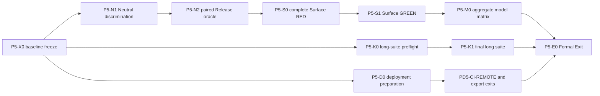

# P5 Formal Exit execution plan

- Status: `APPROVED / GOVERNING`
- Decision date: 2026-08-19
- Governing records:
  [program intent](vulkan-program-intent-framework.md),
  [development report](vulkan-compute-acceleration-development-report.md), and
  [status board](vulkan-compute-acceleration-status.md)

## 1. Purpose and approved decisions

This document is the single execution plan for the remaining P5 closeout.
Current and future P5 closeout work must follow its dependency order, task-card
boundaries, sub-agent rules, acceptance gates, and cleanup policy. A narrow
local smoke, an executor callback, or a CPU fallback row must not be promoted
into a broader completion claim.

The user confirmed all three recommended decisions on 2026-08-19:

1. **Formal-exit scope is authoritative.** P5 closes only after functional
   closure, aggregate model classification, the long top-level gate,
   install/export and deployment evidence, hosted CI evidence, support-matrix
   publication, and final cleanup. Verified CPU fallback is an accepted row
   outcome; it is not silently described as Vulkan support. Optional or
   external lanes such as VTK and a self-hosted Vulkan runner must either pass
   or remain explicitly classified. They are never converted to `PASS` by
   omission.
2. **Isolated repair candidates are authorized.** An isolated worktree may
   test supported MSVC/LLVM OpenMP combinations and ViennaCore repair or pin
   candidates while retaining `/O2 /Ob2 /DNDEBUG /openmp:llvm /MD /Zi` and
   unmodified CPU physics. No dependency or toolchain candidate becomes a
   production default until the paired reference/Mod oracle passes and the
   main line accepts the change.
3. **A closeout checkpoint is authorized.** After reviewing the existing dirty
   tree, the main line may create the `codex/p5-closeout-base` checkpoint. New
   implementation cards must branch or create worktrees from that verified
   checkpoint rather than reconstructing the current P5 diff ad hoc.

## 2. Canonical terms and completion rule

**P5 Functional Closure** means every P5 functional and model row has a proven
eligible Vulkan route or an explicit, verified CPU fallback/unsupported
classification. It includes the Release Neutral CPU oracle, complete surface
Process acceptance, and the aggregate model matrix.

**P5 Formal Exit** means P5 Functional Closure plus the release-facing
deployment, install/export, hosted-CI, support-matrix, long-test, record and
cleanup gates. Only P5 Formal Exit permits the plan to advance to P6/P7.

P5 completion does not require every ViennaPS model to execute on Vulkan. It
requires accurate support claims, CPU-authoritative semantics, safe fallback,
transactional publication and evidence matching each claimed route.

## 3. Verified starting state

The planning audit on 2026-08-19 found:

- the main worktree has 116 status entries: 44 modified and 72 untracked;
- Git records ten worktrees: the main tree and five secondary trees are dirty,
  while four secondary trees are clean cleanup candidates;
- the repository root contains no `build`, `.build`, root `build-*`, or
  `.tmp_*` directory;
- the process-name audit found no running CMake, CTest, compiler, linker,
  MSBuild, Ninja, or ViennaPS smoke executable;
- dirty worktrees and untracked P5 production/test assets are user work and
  must not be deleted or staged implicitly.

This state makes baseline consolidation the first executable dependency. A
sub-agent must not begin a production edit before the checkpoint is reviewed.

## 4. Invariants

1. The unmodified ViennaPS CPU flow and
   `D:\Codex_lib\code_reference\ViennaPS` remain the semantic authority.
2. Vulkan replaces only an admitted compute operation. `Process`,
   `FluxProcessStrategy`, model chemistry, callback/RNG order, Level Set
   ownership and host publication remain CPU-controlled unless a separate
   accepted card says otherwise.
3. Every candidate output is staged. Status, shape, finite values, session
   generation and oracle conditions are checked before publication.
4. Automatic policy falls back to CPU at the accepted boundary. A Manual
   Vulkan request fails closed without partial flux, coverage, metadata or
   geometry publication.
5. A support row is opt-in and predicate-bound. CUDA support, a callback seam,
   configuration success, or an internal CPU oracle is not Vulkan evidence.
6. The main line alone changes a card to `DONE`, integrates its diff, fixes a
   reclaimed card, updates the status board, and makes release claims.
7. Implementation cards use one registered Git worktree and keep build output
   in that worktree's `.build` directory. Root `build-*` directories are
   prohibited.

## 5. Dependency graph



Only read-only preparation or diagnostic runtime work may run ahead of a
predecessor. A downstream implementation or completion-state update must wait
for its incoming gate.

## 6. Executable task cards

### P5-X0-CLOSEOUT-BASELINE

- **Milestone:** produce a reviewable baseline for all remaining P5 work.
- **Owner:** main line; no delegated production edit.
- **Predecessor:** approved plan and decisions in Section 1.
- **Owned records:** worktree/diff manifest, checkpoint branch and closeout
  board entries only.
- **Ordered exits:** classify all current modifications; map every registered
  worktree to a branch, owner and retained diff; verify no active process uses a
  candidate cleanup target; review the aggregate P5 diff; create
  `codex/p5-closeout-base`; verify a clean closeout worktree can configure.
- **Acceptance:** no user change is lost, no unrelated file is staged, and the
  checkpoint contains the exact reviewed P5 baseline.
- **Next unlock:** `P5-N1`, `P5-K0`, and `P5-D0`.

### P5-X1-HYGIENE-CLEANUP

- **Milestone:** remove obsolete build/test environments without deleting
  evidence or active card work.
- **Predecessor:** `P5-X0` manifest and checkpoint.
- **Owned scope:** only targets classified `CLEAN-SAFE` by the manifest.
- **Prohibited:** recursive deletion of the repository root, dirty worktrees,
  untracked P5 source/tests, dependency caches, or an unverified path.
- **Ordered exits:** resolve absolute path; confirm it is not the workspace
  root; check `git worktree list`; verify branch reachability and clean status;
  audit relevant processes; delete or prune the exact target; rerun worktree
  and process audits.
- **Acceptance:** retained worktrees remain usable and every deletion has an
  ownership/evidence record. Cleanup may run between waves but does not unlock
  a physics claim.

### P5-N1-NEUTRAL-ROOTCAUSE-DISCRIMINATION

- **Milestone:** identify a safe external/toolchain repair boundary for the
  Release Neutral oracle.
- **Owner:** sub-agent A, `gpt-5.6-luna`, `xhigh`.
- **Predecessor:** `P5-X0` and the authorized candidate boundary.
- **Global position:** the existing pure-KDTree, synthetic mapping, real-mesh,
  CPUTriangle preflight and changed-code-generation probes already exhausted
  their diagnostic boundaries. This card must not repeat them. It holds the
  full failing fixture, flags, dependency identities and raw output contract
  fixed, and changes one external/toolchain dimension at a time.
- **Owned scope:** isolated toolchain/dependency overlays and the paired test
  runner. Production CPU formulas, the reference physics tree and Vulkan
  eligibility are prohibited.
- **Ordered exits:** freeze the current failing lane; test a supported MSVC and
  LLVM OpenMP closure; if still failing, test one independently reviewed
  ViennaCore candidate; require reference and Mod OMP=1 success before
  expanding the OMP matrix.
- **Acceptance:** a named root-cause category or a single candidate that lets
  both trees complete without changing the required flags or fixture.
- **Retry:** one named `RETRY_ONCE`; a repeated failure is reclaimed to the
  main line.
- **Next unlock:** `P5-N2` only.

### P5-N2-NEUTRAL-ORACLE-GREEN

- **Milestone:** close `P5-NEUTRAL-CPU-ORACLE`.
- **Owner:** reuse sub-agent A with `followup_task`.
- **Predecessor:** main-line acceptance of the `P5-N1` candidate.
- **Owned scope:** the minimal candidate adoption and independent paired
  runner. A production pin/patch is staged but not accepted automatically.
- **Acceptance matrix:** Mod and unmodified reference, OMP 1/2/4/8, exact
  Release flags, identical dependency/runtime closure, exit 0, raw serialized
  process/flux/coverage/geometry equality, no SEH exception, and reproducible
  commands.
- **Main-line gate:** rebuild both sides independently and rerun the full
  matrix before updating the board.
- **Next unlock:** `P5-S0` and `P5-NEUTRAL-VELOCITY-SUBSTAGE` evidence.

### P5-S0-SURFACE-ACCEPTANCE-RED

- **Milestone:** freeze one complete Process-level surface acceptance fixture.
- **Owner:** continue with sub-agent A to retain Neutral/oracle context.
- **Predecessor:** `P5-N2` accepted.
- **Owned scope:** a new focused fixture and narrow CMake/CTest registration.
  No production behavior changes are allowed until RED is deterministic.
- **Required observations:** coverage initialization; source/desorption flux;
  flux and coverage diffusion; Neutral coverage/sticking/desorption state;
  neutral velocity; Level Set advection; process time/result/metadata; callback
  order/count; flux, coverage, conservation and geometry outputs.
- **Negative scenarios:** Auto fallback; Manual fail-closed; incomplete output;
  malformed shape/status; NaN; reset; lost/stale session generation; copied
  callback lifetime; bytewise publication sentinels.
- **Acceptance:** CPU callback-free and shared-session Vulkan routes share the
  same fixture and the intended missing surface boundary is observable.
- **Next unlock:** `P5-S1`.

### P5-S1-SURFACE-INTEGRATION-GREEN

- **Milestone:** close the full surface Process boundary narrowly.
- **Owner:** reuse sub-agent A; main line accepts and fixes reclaimed issues.
- **Owned scope:** only the adapters required by `P5-S0`, plus its fixture.
- **Prohibited:** CPU formula/order changes, a second Process loop, model-matrix
  expansion, shader callback/RNG interpretation, and automatic backend
  promotion.
- **Acceptance:** paired CPU reference evidence, Release Intel Arc
  `Process::calculateFlux()` and `Process::apply()` differential, flux and
  coverage conservation, geometry/time/metadata equality, shared session
  identity, failure rollback and all focused surface/ray regressions.
- **Next unlock:** `P5-M0`.

### P5-M0-MODEL-MATRIX-AGGREGATE

- **Milestone:** close the aggregate 15-row P5 support matrix.
- **Owner:** sub-agent B after `P5-S1`; read-only gap preparation may start
  earlier without editing a support row.
- **Invariant:** P5 closure does not require Vulkan execution for every row.
  Each row must state one of: admitted Vulkan route, exact CPU fallback, or
  explicit unsupported boundary.
- **Acceptance per row:** exact eligibility predicate, independent CPU
  differential, suitable conservation/geometry criterion, Auto/Manual
  behavior, unsupported reason, and no inferred CUDA-to-Vulkan support.
- **Aggregate acceptance:** the inventory, compute map, fallback smoke and
  support matrix agree on all rows; no broad Vulkan enable switch exists.
- **Next unlock:** `P5-K1` and release-facing support documentation.

### P5-K0/K1-TOP-LEVEL-GATE

- **Milestone:** expose long-suite failures early and accept the final P5
  candidate only after a clean full run.
- **Owner:** sub-agent C, reused for both cards.
- **K0 predecessor:** `P5-X0`; this run is diagnostic only.
- **K1 predecessor:** `P5-S1` and `P5-M0` accepted.
- **Ordered exits:** fresh canonical configuration; focused smoke cluster;
  non-benchmark triage if required; complete required top-level CTest on the
  final candidate; retain timeout/flaky classification and first failure;
  explicitly reap and audit descendants.
- **Acceptance:** final required suite passes with no orphaned compiler, CTest
  or Vulkan process. An early K0 pass does not substitute for K1.

### P5-D0/D1-DEPLOYMENT-EXIT

- **Milestone:** close release-facing local and remote evidence.
- **Owner:** a third sub-agent may prepare local evidence; remote writes remain
  main-line actions under separate execution authority.
- **Parallel boundary:** local install/export, profile persistence, workflow
  inspection and VTK packaging diagnosis do not change surface/model code and
  may run after `P5-X0`.
- **Local acceptance:** CPU/no-SDK and opt-in Vulkan payload producer/install/
  independent-consumer tests; profile serialize/provision/reload/stale checks;
  no absolute SDK/cache path in installed artifacts.
- **Remote acceptance:** publish the exact candidate; hosted path-hygiene,
  test and install-export jobs pass; record commit SHA, run IDs and URLs. A
  self-hosted Vulkan lane and VTK lane keep their explicit classifications.
- **Next unlock:** `P5-E0` after `P5-M0` and `P5-K1`.

### P5-E0-FINAL-AUDIT

- **Owner:** main line only.
- **Predecessors:** `P5-N2`, `P5-S1`, `P5-M0`, `P5-K1`, local deployment and
  hosted-CI gates.
- **Acceptance:** self-audit the complete diff; rerun focused CPU/Vulkan gates;
  verify the formal support matrix and Selection Records; update the intent,
  development report, status board and user-facing Preview boundary; clean
  accepted build/test/worktree artifacts; verify retained dirty work is
  unchanged.
- **Completion rule:** only this card may set `P5-DEPLOYMENT-EXIT` to `DONE`.

## 7. Sub-agent dispatch contract

### Capacity and model

- At most three sub-agents run concurrently; the main line occupies the fourth
  execution slot and acts as pipeline supervisor.
- Implementation and multi-step diagnostic cards use `gpt-5.6-luna` with
  `xhigh` reasoning as explicitly selected by the user.
- Initial dispatch uses `fork_turns=none`; the strong card carries the needed
  context and anchors. Consecutive work uses `followup_task` on the same agent.

### Mandatory strong-card fields

```yaml
card_id:
milestone:
predecessor_contract_and_evidence:
next_unlocked_milestone:
global_position: 100-200 tokens
invariants:
owned_files_and_interfaces:
prohibited_scope:
ordered_exits:
acceptance_scenario:
exact_validation_commands:
handoff_boundary:
retry_state:
```

Every worker is told that it is not alone in the codebase, must not revert
another owner's changes, and must adapt to accepted concurrent edits without
crossing its ownership boundary.

### Retry and reclaim

Cards follow:

`READY -> RUNNING -> CHECKPOINT -> RETRY_ONCE -> DONE | RECLAIM`

One retry is allowed only for a named failure with a new evidence target. If
the same boundary fails again, the card is reclaimed with its diff, logs,
commands and unchecked items preserved. A second sub-agent must not repeat the
same task. The main line performs any further fix. A genuinely changed module,
toolchain/dependency boundary or acceptance product requires a new card.

### Handoff and main-line acceptance

Each handoff contains:

- changed and untracked files;
- exact configure/build/test commands and exit results;
- CPU/reference oracle and hardware identity;
- negative/fail-closed scenarios;
- diff-check result;
- residual risk and prohibited claims;
- cleanup state and active-process audit.

The main line independently checks the owned diff, reference boundary,
focused tests, affected regressions, Intel Arc evidence when required, and the
claim boundary. A sub-agent never marks the board `DONE` itself.

## 8. Execution waves

### Wave 0 — main-line baseline

Run `P5-X0`; classify cleanup targets; create and verify
`codex/p5-closeout-base`. Do not dispatch a production card before this exit.

### Wave 1 — critical root cause plus independent preparation

- Agent A: `P5-N1` and then `P5-N2`.
- Agent C: `P5-K0` diagnostic long-suite preflight.
- Third slot: `P5-D0` local deployment/VTK/CI preparation only.

The main line supervises and accepts checkpoints. Downstream surface/model
implementation remains locked.

### Wave 2 — complete surface boundary

- Reuse Agent A for `P5-S0` then `P5-S1`.
- Agent B may perform a read-only aggregate model gap audit.
- Deployment preparation may continue without remote mutation.

### Wave 3 — aggregate and final candidate

- Agent B completes `P5-M0` after `P5-S1`.
- Reuse Agent C for `P5-K1` on the integrated candidate.
- Complete local install/export and prepare the exact remote candidate.

### Wave 4 — remote evidence and final audit

The main line publishes the authorized candidate, records hosted evidence,
performs `P5-E0`, updates all records, and removes only verified cleanup
targets. P6 work stays locked until this wave completes.

## 9. Record-update rule

This plan is governing, not completion evidence. Task results remain in the
status board. The development report summarizes the active wave. The intent
document changes only if an architectural invariant changes. Records are
updated after main-line acceptance, never merely because code exists or a
sub-agent reports success.

## 10. Wave 0 baseline audit snapshot (2026-08-19)

`P5-X0` used three concurrent fast Luna/xhigh read-only cards for production,
records/tests, and worktree hygiene. Main-line review accepted these findings:

- the root contains accumulated accepted prerequisites and pending P5 work;
  the closeout baseline therefore snapshots the explicit source, test, build
  and governing-record set instead of trying to split historical intent by
  filename alone;
- `.claude/` and
  `tests/multibounceFrontierReferenceDifferential/.tmp_mod/` are generated or
  environment state and are excluded from the checkpoint;
- all ten registered worktree paths exist. Dirty worktrees are preserved, and
  the four clean worktrees with unique or disjoint commits remain unclassified;
  no worktree is an approved cleanup target in this wave;
- generated build trees remain unclassified and are not deleted. The process
  name audit found no active compiler, build, test or launcher process, while
  command-line inspection was unavailable and therefore cannot authorize
  destructive cleanup;
- the repository documentation link audit passed. The TEOS velocity board row
  now links its paired CPU fixture, and the project handoff guides use this
  governing execution order.

The baseline checkpoint must be created on `codex/p5-closeout-base` using an
explicit path list. It must not stage `.claude/`, the multibounce `.tmp_mod/`
tree, or any other generated validation tree. The resulting commit SHA and
remote branch are recorded only after staged-diff review and successful push.
