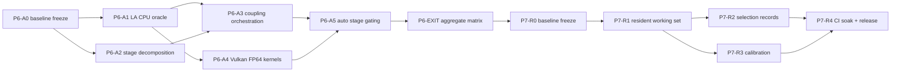

# P6 / P7 execution plan

- Status: `APPROVED / GOVERNING` by user decision 2026-08-21 together with the
  direct P5 completion declaration.
- Predecessors: [intent framework](vulkan-program-intent-framework.md) §13,
  [formal-exit plan](p5-formal-exit-execution-plan.md) §24–§26,
  status-board continuation rows `P6-*` / `P7-*`.
- This document inherits every rule of the P5 closeout regime: serialized
  local validation lane, one verified worktree per card, card-local `.tmp_*`
  directories, CPU-oracle-first evidence, fail-closed defaults, no broad
  backend switches, no machine-local paths in tracked files, main-line-only
  record acceptance and pushes.

## 0. P5 exit record (context for P6)

The user declared P5 complete on 2026-08-21, waiving the hosted-CI evidence
gate explicitly (`PD5-CI-REMOTE` → waived, snapshot already published at
`codex/p5-closeout-base`). Every locally executable acceptance row was green
before the declaration: K1 serial suite 94/94, E0 adversarial audit with zero
VUID diagnostics under forced Khronos validation, VTK-enabled install/export
chain closed via standalone find_package consumption. The X1 hygiene wave ran
its Tier A (four clean worktrees removed with branch refs preserved; stray
`vc140.pdb` deleted; ~11.8 GB of `.tmp_*` evidence trees swept; two install
prefixes plus the instrumented ViennaRay test asset retained by name).

## 1. Governing hardware fact for P6

The only local Vulkan device (Intel Arc graphics) reports
`shaderFloat64 = false`; the deployment profile therefore carries
`fp64SuitePass = false`. Consequences binding all P6 cards:

- Every device-side FP64 row is **implemented + kernel-contract verified +
  classified `DEVICE-PENDING-HARDWARE`**; it must not be claimed runnable.
- Automatic selection resolves every FP64 stage to CPU on this host; a manual
  Vulkan FP64 request fails closed with an explicit reason string.
- True device-FP64 differential evidence is deferred to the hosted
  FP64-capable lane provisioned under `P7-R4` (the deferred CI task resurfaces
  there as a hard dependency, by design rather than by omission).
- FP32 device compute remains governed by the existing strict-FP32 evidence
  thresholds from P5.
- Schema binding: stage-level FP64 eligibility consumes
  `CapabilityProfileRecord::vulkanFp64SuitePass`
  (`include/viennaps/compute/probeProfileAdapter.hpp`), which the deployment
  probe sets only from PASS validation evidence — never from raw
  `shaderFloat64` presence.

## 2. Dependency graph

Only read-only preparation may precede its incoming gate; downstream state
changes wait for main-line acceptance.

## 3. P6 task cards

### P6-A0-P6-BASELINE-FREEZE

- **Milestone:** reviewable starting point mirroring P5-X0 discipline.
- **Ordered exits:** create branch/worktree `codex/p6-base` from the current
  `codex/p5-closeout-base` head; verify clean configure of both canonical
  trees (CPU/no-SDK, opt-in Vulkan) using the retained VTK install prefix;
  classify residual untracked roots (`MakePlane_Substrate/`,
  `coverage_metrics.txt`) with the user or mark `RETAINED-UNOWNED`;
  publish the FP64 capability-contract note from §1 into the capability
  profile schema documentation.
- **Acceptance:** no user change lost; configure receipts recorded; contract
  note merged.
- **Unlocks:** all other P6 cards.

### P6-A1-LA-CPU-ORACLE

- **Milestone:** production-quality CPU linear-algebra layer — the numeric
  authority for every later device claim.
- **Owned scope:** new headers under `include/viennaps/la/`
  (`csrMatrix`, `vectorOps`, `jacobiPreconditioner`, `bicgstabSolver`) with
  deterministic reduction order independent of OpenMP scheduling; focused
  test dir `tests/laCpuOracle`.
- **Required observations:** assembly of the 1D/2D oxidation diffusion
  stencils matches hand-computed references; BiCGSTAB converges on frozen
  SPD systems with identical iterate sequences at OMP 1/2/4/8; residual
  history fingerprints stable; singular/inconsistent systems fail with
  typed errors, never silently.
- **Acceptance:** fingerprint receipts per fixture; `/W4` clean on the new
  layer; no dependence on ViennaPS Process types (pure library layer).
- **Unlocks:** P6-A3, P6-A4.

### P6-A2-OXIDATION-STAGE-DECOMPOSITION

- **Milestone:** replace the monolithic `psOxidation` physics path with four
  independently verifiable CPU stages — oxidant diffusion, pressure/Stokes,
  harmonic extension, deformation — while keeping the public model API and
  default results unchanged.
- **Prohibited:** changing any default oxidation number on existing
  geometries beyond the documented composition tolerance; touching Vulkan
  files.
- **Required observations:** per-stage unit oracles; composed pipeline vs
  monolith parity harness on trench/LOCOS/fin fixtures with before/after
  meshes and rates tables; stage boundaries emit named intermediates for
  later device routing.
- **Acceptance:** parity receipts within documented tolerance; legacy tests
  untouched and green.
- **Unlocks:** P6-A3.

### P6-A3-COUPLING-ORCHESTRATION

- **Milestone:** batched SIMPLE-style outer loop over the P6-A2 stages using
  the P6-A1 solvers, with transactional semantics.
- **Contracts:** non-convergence retains full residual history and rolls back
  geometry/state (no silent partial advance); iteration caps produce typed
  early-termination results consistent with the P3K progress-guard family;
  callback/RNG ordering remains CPU-controlled.
- **Acceptance:** convergence, cap-exhaustion, and injected-failure scenarios
  pass with rollback receipts; long-running scenario stays inside CTest
  timeout budget.
- **Unlocks:** P6-A5.

### P6-A4-VULKAN-FP64-KERNELS

- **Milestone:** FP64 SpMV, AXPY, dot/norm, and reduction shaders compiled
  behind a distinct `VIENNAPS_ENABLE_VULKAN_FP64` build flag (default OFF),
  reusing the P5 primitive session/runtime layers and the E0 resource ledger.
- **Honesty boundary:** local execution is impossible (`shaderFloat64 =
  false`); verification is limited to SPIR-V static validation, kernel-
  contract CPU differentials of the host-side packing/unpacking code, and
  fail-closed dispatch guards that reject FP64 dispatch before queue submit
  when the profile lacks fp64 evidence. Every artifact carries
  `DEVICE-PENDING-HARDWARE`.
- **Acceptance:** flag-off builds are byte-identical in behavior to P6-A3;
  flag-on builds compile clean, pass static checks, and their guard tests
  prove rejection without device round-trip; no FP64 row appears in any
  eligible list.
- **Unlocks:** P6-A5 (gating tests consume these guards).

### P6-A5-AUTO-STAGE-GATING

- **Milestone:** stage-level backend resolution extending the P3D/P3H
  deployment context: each oxidation stage declares precision + compute
  class; Auto intersects with profile evidence exactly like the P5 ray-tier
  predicate family.
- **Required observations:** on this host every P6 stage resolves to CPU;
  manual Vulkan-FP64 fails closed with reason; profile staleness forces CPU;
  no combination of flags produces a device FP64 submission here.
- **Acceptance:** focused gating matrix tests in both Vulkan-on and no-SDK
  configurations.
- **Unlocks:** P6-EXIT.

### P6-EXIT-MODEL-MATRIX-AND-LONG-SUITE

- Aggregate stage-support matrix (CPU-authoritative rows +
  `DEVICE-PENDING-HARDWARE` rows, zero inferred claims), fallback smoke
  extension, then the established top-level receipt: fresh configure, serial
  aggregate build, inventory, focused cluster, serial non-benchmark CTest,
  descendant audit — same shape as the K1/E0 receipts.

## 4. P7 task cards

### P7-R0-P7-BASELINE-FREEZE
Worktree `codex/p7-base` from accepted P6-EXIT; repeat X1-style hygiene for
the P6 wave's temporary artifacts.

### P7-R1-RESIDENT-WORKING-SET
- Cross-step residency of device buffers on the shared deployment session:
  keep-alive registrations extend the E0 ledger with generation-scoped
  liveness, explicit invalidation telemetry, and bounded-transfer metrics.
- Contracts: invalidation after profile/model change rolls back cleanly;
  resident buffers never survive a device reset (ledger guarantees);
  multi-step process demonstrates reduced host transfers vs P5 route with
  measured numbers in the receipt.

### P7-R2-SELECTION-RECORDS
- Deterministic, schema-versioned Selection Record emitted by Auto: inputs
  (profile hash, workload descriptors, stage predicates), decision, and
  expected-cost breakdown; replay tool reproduces the decision byte-for-byte.
- Prohibitions: no wall-clock sampling inside the decision path; no
  environment leakage into records.

### P7-R3-CALIBRATION
- Per-device timing sweeps feed the P7-R2 cost model; deployment profile
  schema gains a calibrated-costs section (schema bump, stale-profile rules
  inherited). Local device contributes FP32 calibration only; FP64 entries
  arrive exclusively from the P7-R4 hosted lane.

### P7-R4-CI-SOAK-RELEASE
- Hard dependency: hosted runner provisioning decisions deferred during P5
  (at least one generic lane, one Vulkan-hardware lane, one FP64-capable lane)
  resurface here as blocking requirements.
- Deliverables: soak runs of the full suites across lanes; release support
  matrix publication reconciling every `DEVICE-PENDING-HARDWARE` row from P6
  against real FP64 hardware evidence or leaving it explicitly unsupported;
  final record reconciliation across intent/report/board per the standing
  record-update rule.

## 5. Standing execution notes

- Cards follow `READY -> RUNNING -> CHECKPOINT -> RETRY_ONCE -> DONE |
  RECLAIM`; the main line alone flips board states and pushes.
- Any product assertion failure stops the owning card at CHECKPOINT with a
  first-failure receipt; remediation is a newly scoped card.
- Documentation updates ride the same cadence as P5: board rows per card,
  report summaries per wave, intent changes only for genuine invariant
  changes.
