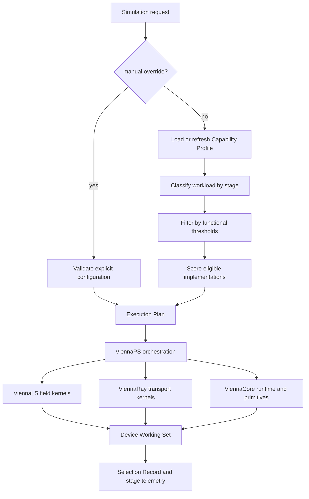
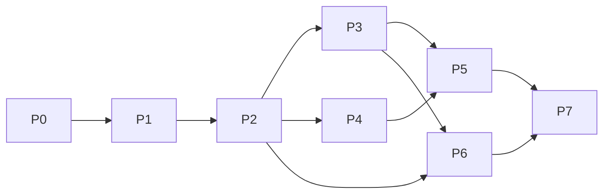

# ViennaPS Vulkan 计算加速开发报告

- 状态：已确认的开发计划
- 基线：ViennaPS 4.6.2 与 `${MPROCESS_SOURCE_DIR}` 指向的本地研究快照
- 日期：2026-08-01
- 决策记录：[ADR-0001](../adr/0001-add-capability-driven-vulkan-backend.md)
- 领域术语：[CONTEXT.md](../../CONTEXT.md)

## 1. 结论

ViennaPS 适合增加 Vulkan 计算后端，但不应把现有 CUDA/OptiX 文件逐个
翻译为 Vulkan，也不应只在 ViennaPS 顶层增加一个孤立实现。完整加速链横跨
ViennaCore 的设备与数值基础设施、ViennaLS 的稀疏 Level Set、ViennaRay 的
输运与相交，以及 ViennaPS 的物理模型和流程编排，因此应按共享后端契约进行
四库协同实现。

目标形态为 CPU、CUDA 和 Vulkan 共存。Vulkan 1.2 Compute 是基础能力；
`VK_KHR_ray_query` 和 `VK_KHR_ray_tracing_pipeline` 是可选的更高光线能力层。
没有硬件光追的 AMD、Intel 或 NVIDIA 设备仍可加速 Level Set、网格、表面场、
扩散和线性求解，并可通过计算着色器软件 BVH 执行光线输运。

**重要工程约束（CPU 路径复用）：** 迁移对象是计算核，不是工艺语义。除
compute 操作外，编排、模型、默认 CPU 引擎、主机侧输运辅助与 Advect 事务须
复用或兼容旧 CPU 路线；空 executor / Manual CPU 必须保持原版行为。完整规范
与 P0–P4 审计见第 12 节及
[意图白皮书](vulkan-program-intent-framework.md) §2.2 第 8 条。

部署或首次使用时，独立探测器生成持久化的能力档案。运行仿真时，选择器根据
硬功能阈值、问题规模、精度要求、显存余量和校准结果逐阶段选择最优实现，无需
用户了解设备细节。用户可以通过 `manual` 配置覆盖所有自动策略；但显式选择
缺失功能或不安全配置时必须失败并解释原因，不能静默改变算法或精度。

这是一项跨基础库的长期工程。建议先交付可验证的 Compute MVP，再扩展硬件
光追和完整物理覆盖。全部工作预计为 58--90 人周；可用于真实 Level Set 与
非光追流程的 MVP 约为 20--30 人周。估算不包含未知的上游合并等待时间。

## 2. 研究范围与事实基线

### 2.1 ViennaPS 当前实现

当前 CMake 只有统一的 `VIENNAPS_USE_GPU` 开关，并把它向 ViennaCore、
ViennaLS 和 ViennaRay 传播，见 [CMakeLists.txt](../../CMakeLists.txt)。GPU 目录
通过 CUDA 编译 callable/model 模块，运行时的 GPU 光线引擎是
`GPU_DISK`、`GPU_TRIANGLE` 和二维 `GPU_LINE`：

- [GPU 构建入口](../../gpu/CMakeLists.txt)
- [流程选择](../../include/viennaps/process/psProcess.hpp)
- [Disk 引擎](../../include/viennaps/process/psGPUDiskEngine.hpp)
- [Triangle 引擎](../../include/viennaps/process/psGPUTriangleEngine.hpp)
- [Line 引擎](../../include/viennaps/process/psGPULineEngine.hpp)

现有 GPU 的主要覆盖是粒子光线输运和通量，而不是整个仿真循环。以下模型已有
CUDA/OptiX 模型路径：Faraday Cage Etching、HBr/O2 Etching、Ion Beam
Etching、Neutral Transport、Multi Particle Process、SF6/O2 Etching、
Single Particle ALD、SF6/C4F8 Etching、Single Particle Process 和 TEOS
PECVD。Multi Particle 的现有 GPU 转换还需要核实多离子类型限制。

氧化模型已经通过 ViennaLS 内部线性代数路径利用 GPU BiCGSTAB 求解扩散、
Stokes、压力和 harmonic extension 的部分系统，但控制循环、装配、边界处理及
若干场更新仍留在 CPU，见 [psOxidation.hpp](../../include/viennaps/models/psOxidation.hpp)。

CPU 侧仍有高价值并行工作：窄带扩展和重建、法向和曲率、Level Set 对流、
表面网格/盘/三角形提取、点元映射、覆盖率与速度计算、表面扩散、几何布尔和
特定模型回调。它们决定了只替换 OptiX 不会得到端到端加速。

### 2.2 mprocess 可借鉴和不可照搬的部分

`${MPROCESS_SOURCE_DIR}` 指向的本地生产后端使用 CuPy、CUDA 12 wheel 和
NVRTC；
`DeviceArray` 实际约束为 CuPy 数组，并不是 Vulkan/OpenCL/HIP 抽象。因此它
证明了更广的 GPU 常驻覆盖可以改善流程，但没有直接解决无 CUDA 环境。

值得参考的具体实现如下：

| 设计经验 | 本地参考 | 对 Vulkan 的用法 |
|---|---|---|
| 设备数据跨阶段常驻 | `backend/mprocess/fields.py`、`stack.py` | 建立显式 Device Working Set 和脏标记，不在每个算子边界下载 |
| Level Set 融合核 | `backend/mprocess/levelset.py` | 把差分、速率和 RK 更新按带宽热点融合为 SPIR-V compute kernel |
| 稀疏砖块实验 | `backend/mprocess/hybrid/` | 参考砖块分类、邻接、裁剪和 stencil；避免全局稠密 SDF 成为 ViennaPS 权威表示 |
| 表面扩散 | `backend/mprocess/surface_diffusion.py` | 使用窄带融合 stencil；图拉普拉斯采用 CSR/邻接表路径 |
| GPU 常驻 BVH8 | `backend/mprocess/physical_etch/disk_bvh.py` | 借鉴数据语义和差分测试；其单线程确定性 builder 不能作为性能实现 |
| 粒子输运和 scatter | `backend/mprocess/physical_etch/transport.py` | 映射为 compute BVH 或 Vulkan RT shader，并保留守恒 scatter |
| 氧化 BiCGSTAB | `node_oxidation_diffusion.py`、`node_oxidation_deformation.py` | 借鉴 source-order reduction、收敛标量过主机和 ILU 实验路径 |
| 运行时治理 | `backend/mprocess/worker.py`、`profiling.py` | 预热上下文、持久 pipeline cache、可疑设备失效、阶段事件计时 |
| 分层等价性 | `docs/baselines/provisional-verification.md` | 区分严格离散场、独立后端数值等价和最终几何等价 |

mprocess 的物理结果仍是 provisional baseline，且部分代码为复现 Vienna 源顺序
牺牲了并行度。参考时应移植契约、数据流和诊断方法，不把它当作新的物理真值，
也不直接把 CUDA 源字符串机械翻译成 Slang。

## 3. 目标架构



### 3.1 构建目标

保留兼容开关，并逐步引入：

```text
VIENNAPS_ENABLE_CUDA=ON|OFF
VIENNAPS_ENABLE_VULKAN=ON|OFF
VIENNAPS_USE_GPU=<deprecated compatibility aggregate>
```

建议在 ViennaCore 提供可选的已编译目标 `ViennaCore::VulkanRuntime`，而
ViennaPS 的公共物理 API 继续保持头文件优先。运行时至少包含：

- `DeviceContext`：实例、物理设备、逻辑设备、队列和生命周期；
- `DeviceBuffer`：VMA 分配、映射、上传、下载和别名视图；
- `KernelPipeline`：SPIR-V、descriptor layout、specialization 和 cache；
- `CommandSequence`：记录、同步、批处理和时间戳；
- `CapabilityProfile`：硬件探测、校准和失效规则；
- `ExecutionPolicy`：资格过滤、评分、回退和选择说明；
- `BackendProfiler`：阶段 GPU 时间、传输量、同步次数和峰值显存。

不要设计一个可以表达任意 GPU API 的庞大虚基类。公共契约只表达 ViennaTools
真正共有的 buffer、dispatch、reduction、scan、sort、sparse matrix 和 ray
query 需求；CUDA 和 Vulkan 可以在契约下面保留各自优化。

### 3.1.1 本地路径与同步边界（强约束）

开发期只允许通过环境变量注入 SDK 与外部依赖路径，不得在源代码、受版本控制的
CMake cache/预设文件、测试脚本、文档示例、安装脚本中写死本机路径。环境差异会
导致后续接手难以复现配置，任何固定路径都不应进入 Git 同步范围。忽略的构建目录
和本地 CMake cache 可以保存解析后的值，但不得被加入版本控制。

- 推荐环境变量：
  - `VULKAN_SDK`
  - `VIENNAPS_VTK_SOURCE_DIR`
  - `VIENNAPS_VIENNALS_SOURCE_DIR`
  - `VIENNAPS_MPROCESS_SOURCE_DIR`
  - `VIENNAPS_DEVICE_PROFILE_DIR`
  - `CPM_SOURCE_CACHE`
- 路径变量不得作为可追踪产物提交到 Git；本地路径只允许通过开发机 shell
  环境、CI 变量或本地 `.gitignore`/配置文件提供。
- 自动发现失败时仅允许“禁用该后端/仅 CPU”回退，不得隐式拼接绝对路径。
- 如需本地覆盖，优先在不会被同步的本地层（例如会话级 CMake cache）定义，并
  在文档里记录环境变量名而非 resolved value。

### 3.2 后端与能力层

```cpp
enum class ComputeBackend { Auto, CPU, CUDA, Vulkan };
enum class VulkanRayMode { None, ComputeBVH, RayQuery, RayTracingPipeline };
enum class SelectionMode { Auto, Manual };
```

能力层不是营销标签，而是由探测结果逐项推导：

| 层 | 硬要求 | 可执行范围 |
|---|---|---|
| `VULKAN_COMPUTE` | Vulkan 1.2、compute queue、所需 storage buffer/descriptor/同步限制 | 通用原语、Level Set、网格、表面场、线性求解、软件 BVH |
| `VULKAN_RAY_QUERY` | Compute 层、acceleration structure、buffer device address、ray query | compute shader 内硬件 BVH 遍历 |
| `VULKAN_RT_PIPELINE` | Compute 层、acceleration structure、buffer device address、ray-tracing pipeline、SBT、deferred host operations | raygen/intersection/any-hit/closest-hit/miss/callable 风格输运 |

Vulkan 官方定义 compute 为所有实现必须具备的能力，并把 acceleration
structure、ray query、ray-tracing pipeline 等定义为关联的可选扩展：
[Compute Shader](https://docs.vulkan.org/tutorial/latest/11_Compute_Shader.html)、
[Ray Tracing](https://docs.vulkan.org/guide/latest/extensions/ray_tracing.html)。

### 3.3 权威数据与设备数据

初期必须保持 ViennaHRLE/ViennaLS 为 Host Canonical Field。Device Working
Set 有两种布局：

1. **Sparse Bricked Narrow Band**：Level Set、法向、速度、覆盖率和材料 ID。
   使用固定尺寸砖块的 SoA payload、活跃砖索引、邻接表和 halo。砖尺寸通过
   specialization constant 和设备校准选择。
2. **Dense Structured Field**：氧化、规则域扩散、JFA/EDT 或规模受限的几何
   算子。只有内存估算通过时才可选。

每个字段维护 host/device generation、owner、dirty range 和 layout version。
一次流程循环内尽量只发生初始上传、必要的 CPU callback 交互和最终提交；
不得在每个 kernel 后同步。无法迁移的用户 callback 形成明确的 device detach
point，并计入选择成本。

## 4. 部署期硬件评价与自动配置

### 4.1 探测入口与生命周期

提供命令行工具和库 API：

```text
viennaps-device-probe --all --calibrate --write-profile
viennaps-device-probe --device <uuid> --validate-profile
viennaps::probeDevices(ProbeOptions)
```

安装器、容器镜像启动脚本或集群节点准备阶段可预先运行。若没有档案，ViennaPS
在首次 Auto 执行前惰性探测；只读环境允许使用内存档案，但 Selection Record
仍必须写入用户提供的结果目录或日志。

默认档案目录遵循操作系统 application-data/cache 约定，并可由
`VIENNAPS_DEVICE_PROFILE_DIR` 或 API 覆盖。档案不得放进源码树。每个物理设备
一个 JSON 文件，原子替换写入；未知字段向前兼容。

### 4.2 Capability Profile 最小模式

```json
{
  "schemaVersion": 1,
  "viennaPsVersion": "4.6.2+vulkan-dev",
  "shaderPackHash": "sha256:...",
  "createdUtc": "2026-08-01T00:00:00Z",
  "device": {
    "uuid": "...",
    "vendorId": 0,
    "deviceId": 0,
    "name": "...",
    "driverId": 0,
    "driverVersion": "...",
    "apiVersion": "1.3.x",
    "pipelineCacheUuid": "...",
    "deviceType": "discrete|integrated|virtual|cpu"
  },
  "memory": {
    "deviceLocalBytes": 0,
    "hostVisibleBytes": 0,
    "budgetExtension": true,
    "measuredSafeWorkingSetBytes": 0
  },
  "compute": {
    "queueFamily": 0,
    "dedicatedQueue": false,
    "maxWorkGroupInvocations": 0,
    "subgroupSizes": [32],
    "shaderFloat64": false,
    "shaderInt64": false,
    "atomicFloat32": false,
    "bufferDeviceAddress": false
  },
  "ray": {
    "accelerationStructure": false,
    "rayQuery": false,
    "rayTracingPipeline": false,
    "maxRayRecursionDepth": 0
  },
  "validation": {
    "primitiveSuite": "pass|fail|not-run",
    "fp32Suite": "pass|fail|not-run",
    "fp64Suite": "pass|fail|not-run",
    "computeBvhSuite": "pass|fail|not-run",
    "hardwareRaySuite": "pass|fail|not-run"
  },
  "calibration": {
    "uploadGBs": 0.0,
    "downloadGBs": 0.0,
    "copyGBs": 0.0,
    "stencilMcellsPerSecond": 0.0,
    "spmvMnonzerosPerSecond": 0.0,
    "reductionGBs": 0.0,
    "softwareBvhMraysPerSecond": 0.0,
    "hardwareBvhMraysPerSecond": 0.0
  },
  "disabledKernels": []
}
```

档案还应保留完整 extension/feature/limit 快照供诊断，但选择器只读取已版本化
的归一字段。`disabledKernels` 支持针对设备/驱动组合隔离已知错误，而不禁用
整个 Vulkan 后端。

### 4.3 档案失效和安全规则

出现以下任一变化时重新执行功能测试；标记为校准相关的变化还要重跑微基准：

- device UUID、vendor/device ID 或 driver ID/version 变化；
- Vulkan API、pipeline cache UUID 或启用的 extension/feature 集变化；
- capability schema、shader ABI、shader pack hash 或数值契约版本变化；
- 上次运行报告 device lost、错误结果、超时或显存预算显著下降；
- 用户显式请求 `--refresh`。

应用版本变化但 shader ABI 和探测 schema 不变时可以复用硬件事实，并只更新
策略评分。档案读取失败、校验和不符或字段未知时不得崩溃：忽略旧档案并重新
探测。pipeline cache 与能力档案分开保存，但使用相同设备指纹验证。

### 4.4 功能阈值

资格判断先于性能评分，且不能被 Auto 策略绕过：

| 工作 | 硬功能阈值 | 失败动作 |
|---|---|---|
| 任意 Vulkan kernel | Compute 层、primitive suite 通过、buffer/descriptor 大小满足该工作集 | 排除 Vulkan |
| FP64 氧化/求解 | `shaderFloat64`、FP64 suite 通过、所需原子或替代 reduction 可用 | 该阶段 CPU/CUDA，或 manual 报错 |
| 稀疏砖块 Level Set | 可容纳砖 payload、邻接、halo 和双缓冲，scan/compaction suite 通过 | 缩小 batch 后重算；仍不足则 CPU |
| Compute BVH | int/bit 操作、sort/scan、BVH differential suite 通过 | CPU ray 或更高硬件 ray 层 |
| Ray Query | acceleration structure、BDA、ray query 及对应测试通过 | Compute BVH |
| RT Pipeline | RT pipeline、SBT alignment/limits、callable/custom intersection 测试通过 | Ray Query 或 Compute BVH |
| 任意自动 GPU 选择 | 预测总驻留不超过动态显存安全预算 | batch、重建执行计划或 CPU |

安全显存不是物理容量的固定百分比。若支持 `VK_EXT_memory_budget`，使用当前
预算减去保留量；否则使用探测得到的保守 safe working set。集成 GPU 需把
主机争用纳入校准，不能只读取 heap size。

### 4.5 自动选择算法

选择单位是仿真阶段组，而不是单 kernel。否则小算子会因上传和提交开销被错误
选到 GPU。建议算法：

```text
if selection.mode == manual:
    validate every explicit stage choice against hard thresholds
    fail with all violated requirements if any choice is impossible
else:
    profile = load_or_probe(device candidates)
    workload = estimate(cells, active_band, particles, surfaces, nnz,
                        precision, callbacks, expected_steps)
    candidates = filter(functional thresholds and memory budget)
    group adjacent stages that can share a Device Working Set
    cost(candidate) = calibrated_kernel_time
                    + predicted_transfer_time
                    + synchronization_and_rebuild_cost
                    + instability_penalty
    choose the lowest-cost complete execution plan
    retain CPU when GPU speedup is below the policy break-even margin
write the chosen and rejected reasons to the Selection Record
```

初始策略使用保守的线性成本模型；收集足够 telemetry 后再按设备族拟合。不得
以“有 Vulkan”直接等价于“所有步骤使用 Vulkan”。针对短作业，CPU 可能是最佳
配置；针对长流程，应提高设备常驻收益的权重。

### 4.6 Manual 覆盖

建议配置面：

```yaml
compute:
  selection: manual       # auto | manual
  backend: vulkan         # cpu | cuda | vulkan
  device: "<device-uuid>"
  precision: mixed        # fp32 | fp64 | mixed
  vulkanRayMode: rayQuery # computeBvh | rayQuery | rayTracingPipeline
  stages:
    levelSet: vulkan
    rayTracing: vulkan
    oxidationLinearSolve: cpu
  allowStageFallback: false
```

优先级固定为：API/任务级 manual > 配置文件 manual > 环境变量 manual > Auto
策略。manual 可以选择较慢但功能正确的实现，不能启用设备未提供的 extension、
越界工作组、超预算分配或缺失 FP64 的 FP64 kernel。`allowStageFallback` 仅表示
显式授权列出的阶段回退，默认 false。

Selection Record 至少写入设备指纹、档案 hash、策略版本、工作量估计、逐阶段
选择、淘汰原因、manual 来源、实际峰值显存和计时，从而可以重放选择。

## 5. Vulkan 功能实现矩阵

阶段编号与第 8 节一致。所有条目均需先有 CPU reference 和独立小规模 oracle。

### 5.1 通用原语与数据管理

| 功能 | Vulkan 实现 | 阶段 |
|---|---|---|
| fill/copy/cast/transform | SSBO 一维 dispatch；连续 SoA；小常量用 push constants | P1 |
| reduction | subgroup + shared memory 两级归约；确定性模式固定归约树 | P1 |
| prefix scan | subgroup scan、block sums、全局 fix-up；支持 exclusive/inclusive | P1 |
| compact/partition | predicate + scan + scatter，输出 indirect dispatch count | P1 |
| radix sort | 32/64-bit key-value，多 workgroup histogram/scan/scatter | P1 |
| gather/scatter | 边界检查的索引 kernel；守恒 scatter 提供排序归约与 atomic 两种模式 | P1 |
| histogram | per-workgroup bins 后归并；subgroup size specialization | P1 |
| RNG | counter-based RNG，以 seed、particle ID、bounce、step 为 counter | P1 |
| CSR SpMV/AXPY/dot/norm | row-adaptive SpMV，融合向量更新，固定树 reduction 可选 | P2 |
| staging/transfer | VMA device-local arena + 可复用 host-visible ring；批量提交 | P1 |

排序可以参考 Fuchsia 的
[RadixSort/VK](https://fuchsia.googlesource.com/fuchsia/+/refs/heads/main/src/graphics/lib/compute/radix_sort/README.md)，
但集成前必须核实许可证和 ViennaPS 数据布局。小型
[VkRadixSort](https://github.com/MircoWerner/VkRadixSort) 适合理解 pass 编排，
不应直接作为多厂商性能基线。

### 5.2 Level Set 与几何场

| 功能 | Vulkan 实现方法 | 关键验证 | 阶段 |
|---|---|---|---|
| HRLE → sparse bricks | 活跃 run 分类、Morton key、sort/unique、payload scatter | 索引/符号/材料逐点一致 | P2 |
| brick halo/邻接 | sort 后建立 2D/3D 邻接；缺失砖采用域边界语义 | 周期/反射/无限边界 | P2 |
| 窄带 expand/prune | frontier 标记、scan/compact、邻砖生成、generation swap | 宽度和活跃点集合 | P2 |
| 法向/梯度/曲率 | brick-local stencil + halo；一侧/中心差分 specialization | 平面、球、尖角 | P2 |
| 速度延拓/插值 | nearest-point/JFA 可选稠密路径；稀疏 fast sweeping/迭代传播 | 符号侧和材料接口 | P3 |
| Hamilton-Jacobi 速率 | EO/LF/SLLF 各自 kernel；公共 stencil 读路径 | 每 scheme 的局部速率 | P3 |
| 时间推进 | Euler、RK2、RK3；融合速率与阶段更新，保留中间速度 callback gate | 单步和累计界面误差 | P3 |
| CFL/自适应步长 | GPU max reduction；只把标量 dt 送回主机 | CPU 步长序列 | P3 |
| reinitialize/redistance | seed 重建 + iterative sweeping 或 JFA 候选；窄带重构 | 距离误差和零界面不漂移 | P3 |
| stray point/component | 邻域标记、connected-component label、scan/compact | 连通定义和材料保留 | P3 |
| Boolean/offset/planarize | 对齐域上的 min/max/offset；非对齐域先显式 resample | CPU 几何等价 | P3 |
| wet etch/epitaxy anisotropy | 晶向速率放入 Slang 模块，融合到 HJ kernel | 晶向基准和角点演化 | P5 |

不建议首期把 HRLE 容器本身完全搬到设备。P2/P3 的提交边界仍回写 Host
Canonical Field；P7 才允许跨多个 process step 保持 device authoritative，
并需加入崩溃恢复和 callback 失效协议。

### 5.3 表面提取、网格和空间结构

| 功能 | Vulkan 实现方法 | 阶段 |
|---|---|---|
| active-cell/surface extraction | 单元分类、scan、并行写顶点和元素 | P3 |
| marching squares/cubes | case table 放只读 buffer；两遍 count/emit；确定索引排序 | P3 |
| disk mesh | 从零界面节点生成 position/normal/radius/material SoA | P3 |
| triangle mesh | 并行生成三角形、法向、材料和邻接；退化三角形 compact | P3 |
| point ↔ element translation | 空间 key sort + 邻接查找；稳定 tie-break | P3 |
| surface smoothing | 邻接图 Laplacian/加权平均；边界和材料接口锁定 | P3 |
| LBVH/compute BVH | Morton code、radix sort、并行 hierarchy、bottom-up bounds | P4 |
| hardware AS | triangle geometry 直接 build；disk/line 使用 AABB + custom intersection | P4 |
| dynamic update | 拓扑不变 refit，拓扑变化 rebuild；由成本模型选择 | P4/P7 |

Khronos 的 GPU-resident tree 教程给出了 Morton code、radix sort 和并行层级
构建的基本路径：[GPU-Resident Trees](https://github.khronos.org/Vulkan-Site/tutorial/latest/Advanced_Vulkan_Compute/06_Advanced_Data_Structures/02_gpu_resident_trees.html)。
mprocess BVH8 用于语义和边界差分，不复用其单线程 builder。

### 5.4 粒子输运与光线追踪

| 功能 | Compute BVH | Ray Query | RT Pipeline | 阶段 |
|---|---|---|---|---|
| source sampling | compute kernel 生成粒子队列 | 同左 | raygen 内生成或消费队列 | P4 |
| triangle hit | 软件 stack/stackless traversal | compute 内 `rayQuery` | 内建 triangle intersection | P4 |
| disk/line hit | 自定义 primitive test | AABB candidate 后确认交点 | AABB + intersection shader | P4 |
| periodic/reflective boundary | wrapper traversal，更新 origin/direction/cell | compute 状态机 | raygen 循环或有限 trace 次数 | P4 |
| closest/any hit 过滤 | traversal 内材料和邻域过滤 | candidate/committed 控制 | any-hit/closest-hit | P4 |
| reflection/scattering | 命中后更新 particle state，compact 活跃队列 | 同一 compute 循环 | hit/callable 后回到 raygen 状态 | P4 |
| multi-bounce termination | indirect dispatch queue，roulette counter RNG | 同左 | 控制 recursion 深度，优先迭代式 wavefront | P4 |
| flux accumulation | deterministic sort-reduce 或 atomic fast mode | 同左 | 写 event buffer 后 compute reduce | P4 |
| secondary surface flux | 独立 event queue，避免递归 payload 膨胀 | 同左 | wavefront queue 优先 | P5 |
| multi-particle species | SoA queue + species specialization/dispatch | 同左 | pipeline library/SBT group | P5 |

RT pipeline 可以自然映射现有 OptiX callable 和自定义 intersection，但不应
把深递归当默认设计。Khronos 指南指出 payload、hit attributes 和 callable
data 会消耗 driver-managed memory，应保持小型化；因此推荐 wavefront 队列和
compute reduction。

每种物理模型的 CUDA callable 应拆成后端无关的参数结构、CPU reference 函数
和 Slang physics module。P4 先覆盖 Single Particle、Ion Beam 和 Neutral；
P5 再覆盖现有全部十个 GPU 模型并解除 Multi Particle 单离子限制。CPU-only
Fluorocarbon、Plasma、TEOS Deposition 等模型在 surface algebra 可表达后加入，
不能仅因模型名相似宣称支持。

### 5.5 覆盖率、表面化学和速度

| 功能 | Vulkan 实现 | 阶段 |
|---|---|---|
| flux normalization/smoothing | per-species reduction + graph/stencil smoothing | P5 |
| coverage 初始化/重映射 | surface key correspondence + gather；新点使用模型初值 | P5 |
| coverage steady iteration | 每点残差 kernel + max reduction；只回传收敛标量 | P5 |
| adsorption/desorption/reaction | Slang 模块化逐点代数；species 用 SoA | P5 |
| material-dependent rates | compact material ranges 或分支 specialization | P5 |
| calculateVelocities | flux/coverage/normal/material 融合逐点 kernel | P5 |
| surface-to-level-set velocity | point-element map + gather/scatter + extension | P5 |
| user surface callback | CPU detach point；未来提供受限 SPIR-V/Slang callback API | P5/P7 |

首期不承诺任意 C++ 用户 callback 在 GPU 执行。选择器必须估算 callback 导致的
下载/上传；manual 指定全 Vulkan 但 callback 不可迁移时应报告冲突，而不是
在每步隐式往返。

### 5.6 表面扩散和传输方程

现有 [psSurfaceDiffusion.hpp](../../include/viennaps/process/psSurfaceDiffusion.hpp)
和 Neutral Transport 内的 diffusion matrix 适合两条路径：

- 规则窄带：融合 Laplacian、源项和显式时间步，halo 共享内存复用；
- 非规则表面图：CSR/邻接表 SpMV、Jacobi/diagonal preconditioner、BiCGSTAB/CG。

稳定性步长用 GPU reduction 求得。必须验证质量守恒、常数场 Laplacian 为零、
材料边界 no-flux 和非均匀点间距。VkFFT 只在后续证明规则周期问题适合谱方法时
评估；当前算法不因存在 [VkFFT](https://github.com/DTolm/VkFFT) 而改写物理离散。

### 5.7 氧化、Stokes、压力和形变

氧化是精度和稀疏求解风险最高的部分，排在 P6：

1. 把规则域/节点字段装入 dense SSBO 或稳定 CSR；并行完成 active node、边界
   类型、row count、scan 和 row fill。
2. 提供 FP64 SpMV、dot、infinity norm、AXPY 和 source-order deterministic
   reduction；用 CPU 小矩阵 oracle 验证。
3. 先实现 diagonal/Jacobi 预条件的 BiCGSTAB，再评估 ILU0。Vulkan 生态没有
   可直接替代 cuSPARSE 的成熟通用稀疏求解依赖，因此核心路径必须自有、可测。
4. 将 oxidant diffusion、pressure、Stokes、harmonic extension 和 deformation
   逐个迁移；每迁移一个系统都保留阶段级 CPU fallback。
5. SIMPLE/耦合控制初期留在主机，只传回残差、时间步和少量控制标量。稳定后再
   把完整 outer iteration 记录为 command sequence。
6. 压力激活、`exp`、阈值比较和边界装配需要 ULP/分支差分测试，不能只比较
   最终图像。

FP64 是这些 kernel 的 Functional Threshold。缺失 FP64 的设备仍可运行其他
Vulkan 阶段，氧化求解自动落回 CPU/CUDA。FP32 或 mixed precision 优化只有在
P6 parity gate 通过后才能作为显式策略候选。

### 5.8 不优先或不适合 GPU 的功能

- 配置解析、模型构造、日志、元数据和少量控制逻辑；
- 小规模几何的一次性构造，上传成本高于计算；
- 文件 I/O、VTK 序列化和文本输出，GPU 只可帮助最终 packing；
- 任意复杂用户 C++ callback；
- 极小 CSR 系统和迭代次数很少的求解；
- 需要频繁 CPU 决策且不能批处理的异常路径。

这些功能仍进入 Execution Plan 的成本模型，但不设“GPU 覆盖率”形式主义目标。

## 6. 着色器、运行时和开源参考

### 6.1 推荐依赖

| 项目 | 采用方式 | 采用内容 | 不采用内容 |
|---|---|---|---|
| [Slang](https://github.com/shader-slang/slang) | 构建期工具，锁定版本 | 模块、泛型、specialization、SPIR-V 输出 | 首期不要求运行时 JIT |
| [SPIRV-Tools](https://github.com/KhronosGroup/SPIRV-Tools) | 构建/CI | `spirv-val`、优化和反汇编诊断 | 不在生产任务动态优化 |
| [Vulkan Memory Allocator](https://github.com/GPUOpen-LibrariesAndSDKs/VulkanMemoryAllocator) | 运行时依赖 | memory type、suballocation、budget、统计 | 不让 VMA 决定字段生命周期 |
| Vulkan loader/Hpp | 运行时/头文件 | API 装载、类型安全和 RAII | 不把 Vulkan 对象暴露给物理模型 |

SPIR-V 在构建期生成并嵌入或随 shader pack 安装。CI 对每个 capability variant
执行 `spirv-val`。运行时只基于 specialization constants 创建 pipeline，降低
用户部署对编译器的要求和首任务抖动。

### 6.2 重点参考项目

| 项目 | 可参考的具体实现 | 结论 |
|---|---|---|
| [Khronos Vulkan Samples](https://github.com/KhronosGroup/Vulkan-Samples) | feature chain、同步、compute、ray query/RT 样例 | API 正确性首选参考 |
| [llama.cpp Vulkan](https://github.com/ggml-org/llama.cpp) | 多后端共存、设备枚举、shader 生成、运行时选设备 | 参考后端边界和构建，不参考张量算子 |
| [ncnn](https://github.com/Tencent/ncnn) | allocator、pipeline cache、设备 quirk、长 command 分段、specialization | 参考跨移动/桌面驱动治理 |
| [Radeon Rays](https://github.com/GPUOpen-LibrariesAndSDKs/RadeonRays_SDK) | Vulkan AS、异步 intersection API、custom AABB、BVH update | 做原型/对照，不设为强依赖 |
| [Vulkan Kompute](https://github.com/KomputeProject/kompute) | tensor/algorithm/sequence 的小型 compute 包装 | 只参考易用性；维护状态和 fork 情况不足以承担核心 ABI |
| `${MPROCESS_SOURCE_DIR}` | GPU 常驻流程、融合 kernel、阶段 parity、worker 预热 | 参考领域实现和测试，不参考后端抽象 |

所有引入代码在实现前必须完成许可证、维护活跃度、平台覆盖和供应链审查，并在
`THIRD_PARTY_LICENSES.md` 更新。GPL-3.0 的 ViennaPS 可以使用 permissive
依赖，但复制 shader 源仍需保留原始许可和归属。

### 6.3 驱动差异策略

- 所有可选 feature 通过完整 `pNext` chain 查询，不按 vendor 猜测；
- workgroup/subgroup、shared memory、descriptor 数量均由 profile specialization；
- 为已知 driver/kernel 组合维护数据驱动 quirk 表，包含证据和到期版本；
- device lost、validation error、错误 sentinel 或超时会隔离当前 profile；
- production 默认不开 validation layer，开发和 CI 必须可开启；
- pipeline cache 按 device/driver/cache UUID/shader hash 隔离；
- 大 command sequence 依据校准和 watchdog 风险分段提交。

## 7. 数值、正确性和性能验证

### 7.1 等价性层级

1. **Kernel contract**：小数组、边界和恶意输入逐元素验证。
2. **Strict discrete parity**：相同离散表示、顺序和随机流；用于定位首个分歧。
3. **Backend numerical parity**：允许并行归约和独立 BVH 导致的小数差异，但物理
   守恒量、场范数和界面误差必须在模型阈值内。
4. **Geometry parity**：最终界面的 Hausdorff/Chamfer、体积、关键 CD/depth。
5. **Physics acceptance**：氧化厚度、bird's beak、刻蚀率、沉积共形性等模型量。

mprocess 使用的 `1e-4 voxel` strict source parity 和 `1e-2 voxel` 独立 ray
backend 数值等价可作为初始候选，不直接成为 ViennaPS 全模型统一阈值。P0 必须
根据现有 CPU/CUDA 的自然方差，为每个模型固定 tolerance manifest。

### 7.2 随机与确定性

- counter RNG 的逻辑坐标不依赖 dispatch 顺序；
- CPU/CUDA/Vulkan 尽量共享采样变换的测试向量；
- `deterministic` 模式使用固定排序和归约树，便于 CI 和差分；
- `fast` 模式可用原子累积和设备最优 subgroup，但必须满足统计验收；
- 报告 seed、RNG 版本、粒子数、backend 和 mode。

### 7.3 CI 矩阵

| 层 | 环境 | 运行内容 |
|---|---|---|
| Build | Windows/Linux，无 Vulkan SDK runtime 假设 | CPU-only 和可选 Vulkan 编译隔离 |
| Software Vulkan | Mesa Lavapipe | compute primitive、SPIR-V、选择器和小规模 parity |
| AMD hardware | Windows/Linux | Compute、FP64、Ray Query/RT 按设备能力 |
| Intel hardware | Windows/Linux | iGPU/UMA 内存、Compute、可用 ray 层 |
| NVIDIA hardware | Windows/Linux | Vulkan 与现有 CUDA/OptiX 三方 parity/performance |
| Sanitized dev | validation layer + debug shader | barrier、descriptor、越界和 lifetime |

Lavapipe 是 CPU 软件 Vulkan，只证明 API/着色器正确性，不代表真实 GPU 性能或
光追支持。硬件 CI 才能提升 Capability Profile 的 `validation` 状态。

#### 7.3.1 本仓库当前 CI 接入边界

当前 `.github/workflows/build.yml` 将默认回归与硬件实测入口隔离：

- 必需的 `path-hygiene` job 在托管 Ubuntu runner 上只扫描本切片的两个受控文件，
  拒绝绝对本机路径和硬编码的 SDK environment assignment。它的验收命令与 workflow 相同；命令
  无匹配时每个 `git grep` 必须以退出码 `1` 结束，整个循环以 `0` 结束。规则
  使用边界和安全分段，因而不会把自身规则、合法 URL 或示例文本当作路径：

  ```bash
  patterns=(
    '(^|[[:space:]`"=])[A-Za-z]:[\\/]'
    '(^|[[:space:]`"=])/User''s/'
    '(^|[[:space:]`"=])/home/'
    '(^|[[:space:]`"=])/mnt/'
    '(^|[[:space:]`"=])/workspace/'
  )
  sdk_name='VULKAN_SDK'
  patterns+=("${sdk_name}[[:space:]]*=[^`\"[:space:]]")
  for pattern in "${patterns[@]}"; do
    if git grep -n -E "$pattern" -- \
        .github/workflows/build.yml \
        docs/design/vulkan-compute-acceleration-development-report.md >/dev/null; then
      exit 1
    fi
  done
  ```

  这项检查只证明受控 CI/开发报告没有把本机路径或 SDK 赋值带入版本控制；它不把
  临时目录存在本身当作验收，也不替代硬件矩阵的设备/驱动证据审查。

- 托管 `test` job 在所有平台显式使用
  `VIENNAPS_ENABLE_VULKAN=OFF`、`VIENNAPS_BUILD_VULKAN_PROBE=OFF` 和
  `VIENNAPS_BUILD_VULKAN_SMOKE=OFF`。它不安装 Vulkan SDK，仍执行标准 CPU 构建和
  非基准 CTest；对应的最小本地命令为：

  ```powershell
  cmake -S . -B build `
    -DVIENNAPS_BUILD_TESTS=ON `
    -DVIENNAPS_ENABLE_VULKAN=OFF `
    -DVIENNAPS_BUILD_VULKAN_PROBE=OFF `
    -DVIENNAPS_BUILD_VULKAN_SMOKE=OFF
  cmake --build build --config Release
  ctest --test-dir build -C Release --output-on-failure -E "Benchmark|Performance"
  ```

- `install-export` 是独立的 Ubuntu CPU/no-SDK job。它以
  `VIENNAPS_USE_VTK=OFF`、`VIENNAPS_VTK_RENDERING=OFF` 和所有 Vulkan
  开关关闭的方式执行 `cmake/run-pd5-install-export.cmake`；脚本先在
  `$RUNNER_TEMP` 安装完整的依赖闭包，再将 `CMAKE_PREFIX_PATH` 限定为该
  prefix，配置、编译并运行 `tests/installExportConsumer`。Producer 配置
  明确关闭 `CMAKE_FIND_USE_INSTALL_PREFIX`，避免半成品 install prefix 被
  自己误当作依赖。这个 gate 证明 `find_package(ViennaPS)`、
  `ViennaTools::ViennaPS` 目标和传递依赖对干净消费者有效；它不启用 VTK、
  CUDA 或 Vulkan，也不替代硬件 lane。

- 本地另有显式的 `cmake/run-pd5-vulkan-install-export.cmake` 场景。它要求
  Vulkan SDK，使用 `VIENNAPS_INSTALL_VULKAN_PAYLOAD=ON` 安装 runtime、GLSL、
  SPIR-V 和导出 target，并以 `tests/vulkanInstallExportConsumer` 验证；该
  场景已在 Release/Intel Arc 主机构建树通过；独立 consumer 还覆盖了安装后
  profile 的序列化、provision/reload 和 stale-fingerprint fail-closed 选择，
  但尚未成为 hosted CI job，也
  不代表 Process preview 或自动后端 promotion。

- `vulkan-hardware` 只接受 `workflow_dispatch` 的
  `run_vulkan_hardware=true`，并要求 `self-hosted`、`vulkan` 两个 runner 标签。
  该 job 不在 push 或 pull request 上自动运行，也不替托管 runner 安装 SDK；SDK、
  loader/driver 和 shader compiler 均由受管控 runner 提供。它使用下列同一组
  CMake/CTest 入口构建 `viennaps-device-probe`，运行严格 FP32 probe，并执行已有
  的四个部署控制面测试：

  ```powershell
  $buildDir = Join-Path $env:RUNNER_TEMP "viennaps-vulkan-build"
  cmake -S . -B $buildDir `
    -DVIENNAPS_USE_VTK=OFF `
    -DVIENNAPS_VTK_RENDERING=OFF `
    -DVIENNAPS_BUILD_TESTS=ON `
    -DVIENNAPS_ENABLE_VULKAN=ON `
    -DVIENNAPS_BUILD_VULKAN_PROBE=ON `
    -DVIENNAPS_BUILD_VULKAN_SMOKE=ON
  cmake --build $buildDir --config Release --target `
    viennaps-device-probe `
    capabilityProfileIO `
    probeProfileAdapter `
    vulkanDeploymentProbe `
    vulkanDeploymentBootstrap
  ctest --test-dir $buildDir -C Release --output-on-failure `
    -R "^(capabilityProfileIO|probeProfileAdapter|vulkanDeploymentProbe|vulkanDeploymentBootstrap)$"
  ```

  probe 输出、deployment profile 和失败日志只写入 `$RUNNER_TEMP`，不进入仓库或
  CI 摘要，避免提交本机路径、设备名或驱动标识。该 lane 的可验证结果是对应的
  workflow check；需要用于硬件矩阵的原始 JSON、设备/驱动指纹和队列证据时，仍由
  主线按 [状态文档](vulkan-compute-acceleration-status.md) 的受控流程记录。
  通过这个可选 lane 不等于完成硬件矩阵、性能门禁或 PD5；它也不是 CPU/no-SDK
  回归的替代品。

### 7.4 性能门禁

P0 固定代表性 2D/3D、小/中/大、ray-heavy、advection-heavy 和 oxidation-heavy
基准。之后每个工作包同时报告：

- kernel GPU 时间和端到端 wall time；
- 上传、下载字节和显式同步次数；
- 峰值与常驻显存；
- pipeline/AS/BVH 建立和复用成本；
- CPU、CUDA、Vulkan Compute、Vulkan RT 的同场景结果；
- Auto 是否选择实际最快的合格计划。

初始合并门：目标阶段在中型基准上至少比 CPU 快 1.5x，或证明它显著减少了
下一阶段数据搬运；端到端不得比策略预测慢 15% 以上。此门槛在 P0 基准冻结后
可通过 ADR 调整。正确性优先于速度，未达性能门只表示不进入 Auto 候选，不阻止
以 experimental/manual 方式保留正确实现。

## 8. 可执行开发计划

### P0：契约、基准和拆分设计（2--3 人周）

- 冻结 CPU/CUDA 场景、tolerance manifest、seed 和输出指标；
- 在四个仓库确认 backend ownership 与版本兼容矩阵；
- 记录现有每阶段计时、传输和 GPU 覆盖；
- 定义 `CapabilityProfile`、`ExecutionPlan`、`SelectionRecord` JSON schema；
- 为当前十个 GPU 模型建立 callable/参数清单；
- 输出：三库接口设计 PR、基准数据和 P1 task cards。

退出门：CPU/CUDA baseline 可重放；所有跨库接口有 owner；不存在“Vulkan 支持”
但没有可测 acceptance 的任务。

### P1：Vulkan runtime、探测与原语（6--9 人周）

- ViennaCore Vulkan runtime、VMA arena、staging ring、command sequence；
- 离线 Slang/SPIR-V 构建、reflection manifest 和 pipeline cache；
- 部署探测器、档案持久化/失效、微基准和 quirk 基础设施；
- fill/reduction/scan/compact/sort/gather/scatter/RNG；
- Execution Policy、Manual Override 和 Selection Record；
- Lavapipe + 三厂商 smoke CI。

退出门：在无 CUDA 环境完成 probe → profile → auto plan → compute dispatch；
修改 driver/profile 后正确失效；manual 不支持项给出完整诊断。

### P2：设备字段与稀疏线性基础（5--8 人周）

- HRLE ↔ sparse brick 转换、halo、邻接、expand/prune；
- dense structured field、generation/dirty ownership；
- CSR 装配原语、SpMV、AXPY、dot/norm、Jacobi；
- 内存估算、batch 和 OOM 前置拒绝；
- 微型场与矩阵 differential tests。

退出门：2D/3D 字段 round-trip、边界和材料逐点通过；无隐式 device-wide sync；
profile 可以据显存与 FP64 正确过滤。

### P3：Level Set、网格与几何（8--12 人周）

- normal/curvature、EO/LF/SLLF、Euler/RK2/RK3、CFL；
- narrow-band rebuild、reinitialize/redistance、stray removal；
- surface/disk/triangle extraction、mapping 和 smoothing；
- Boolean、offset、planarize 及常用几何 kernel；
- 首个端到端 geometric/isotropic/directional process。

退出门：代表性几何满足 tolerance manifest；中型加速达到 Auto 性能门；CPU
callback detach 可见且不会破坏 field generation。

### P4：Vulkan 光线基础（10--16 人周）

- Compute LBVH/BVH traversal 和 disk/line/triangle 相交；
- Ray Query 与 RT Pipeline capability variants；
- source RNG、边界、反射、roulette、event queue、flux reduction；
- Single Particle、Ion Beam、Neutral 三个纵向模型；
- AS rebuild/refit 成本进入 Execution Policy。

退出门：无硬件 RT 的 Vulkan 设备可完成 ray process；有 RT 的设备自动比较
Compute BVH/Ray Query/RT Pipeline；三种实现通过同一 differential suite。

### P5：表面物理与模型覆盖（8--12 人周）

- coverage lifecycle、surface algebra、velocity 和表面扩散；
- 移植现有全部 CUDA/OptiX 模型；
- Multi Particle 多离子 species；
- Fluorocarbon、Plasma、TEOS Deposition 等高价值 CPU 模型；
- wet etch、selective epitaxy、oxide regrowth 的公共 stencil/field 部分。

退出门：模型支持矩阵逐项有测试，不以编译成功代表支持；覆盖率/质量守恒和
最终几何同时通过。

### P6：氧化与耦合求解（10--16 人周）

- FP64 matrix assembly、BiCGSTAB/Jacobi、确定性 reduction；
- oxidant diffusion、pressure、Stokes、harmonic extension、deformation；
- outer SIMPLE/coupling 的 command batching；
- ILU0 作为实验优化，收敛不稳时保留 Jacobi/CPU；
- trench、fin、LOCOS 氧化的场级和物理级验收。

退出门：FP64 合格设备进入 Vulkan Auto；无 FP64 设备只回退相关阶段；所有
收敛失败包含 residual history 和执行计划，不产生静默错误几何。

### P7：全流程常驻、调优与发布（9--14 人周）

- 跨 process step device-resident execution、callback invalidation；
- workload cost model 校准、pipeline/AS cache 和 command 分段；
- Python/C++ 配置、probe CLI、诊断与安装文档；
- 驱动兼容矩阵、长时 soak、device lost 恢复和 release gates；
- 对 CUDA/CPU 的回归与旧 `VIENNAPS_USE_GPU` 迁移期兼容。

退出门：Auto 在硬件矩阵上选择合格且接近最快的执行计划；Selection Record
足以重放；CPU-only 构建和既有 CUDA 使用方式无非预期回归。

### 8.1 依赖关系和并行工作



P3 与 P4 在 P2 后可由不同开发者并行；P6 的线性代数可在 P3 后与 P5 并行。
建议至少设置 runtime/primitives、Level Set/geometry、ray/physics 三个 owner，
主线负责 schema、parity 和发布门禁。单人执行应严格按依赖顺序，不并行维护
多个未过 parity gate 的物理路径。

### 8.2 首个可发布切片

不要等待 P7 才发布。建议三个可独立验收的切片：

1. **Vulkan Compute Preview**：P0--P2，probe/profile/manual、原语和字段工具；
2. **Vulkan Level Set Preview**：P3，可运行非光线 geometric process；
3. **Vulkan Process Preview**：P4--P5，至少三个光线模型和表面物理；
4. **Vulkan Full Physics**：P6--P7，氧化、完整 Auto 和兼容发布。

每个 Preview 都必须标注支持矩阵，不用一个总开关暗示尚未实现的模型可用。

### 8.3 当前执行快照（2026-08-06）

当前实现已经跨过“Vulkan runtime / deployment profile / Level Set seam / ray
device data chain”的可验证基础阶段，并已完成 `P5-RAY-ROUTE` 的本地验收：
`ray_flux_process_route_smoke` 在 Intel Arc Release Vulkan 上通过
`Process::calculateFlux()` 将 `SingleParticleProcess<float, 2>` 注入到
`VulkanRayFluxEngine`，与 `CPU_TRIANGLE` 基准比较，totalRelDiff=0.29%、
maxRelDiff=2.07%、20000/20000 条光线命中，fail-closed 的未准备上下文未沉积任何
flux 数据。

`P5-RAY-PHYSICS` 已于 2026-08-06 完成本地验收。该切片在
`include/viennaps/ray/` 中定义了反射、俄罗斯轮盘、事件队列和表面响应的 CPU
端契约，并复用 ViennaRay 的 `ReflectionDiffuse` / `ReflectionSpecular` /
`ReflectionConedCosine`、ViennaRay 的轮盘阈值/续重常量，以及
`SurfaceModel` / `MaterialMap` 的 CPU 契约；公共头文件不出现 Vulkan 类型，
也不改动 `Process` / `FluxProcessStrategy`。验收测试 `rayPhysics` 在复用的
Release MSVC C++20 构建中通过：`Test #81: rayPhysics ... Passed 0.54 sec`。

这仍不等于 Vulkan Process Preview 或 P6--P7 Full Physics 发布状态：
多反射/俄罗斯轮盘、表面物理覆盖、跨厂商矩阵、远端 CI 和 release gate 均未完成。

PD0--PD4 的本地控制面和 `PD5-CI-DOCS-INTEGRATION`、`PD5-INSTALL-EXPORT` 的本地
CPU/no-SDK 验收已经有记录；这只能说明本地证据链可重放。GitHub 远端 CI 仍是独立
门禁：最后一次本地抓取的 `origin/HEAD` 指向 `origin/master`，该快照含有旧版
`build.yml`，但没有当前 PD5 `path-hygiene`、`install-export` 或 Vulkan hardware
job。该本地 ref 不能证明当前远端默认分支或 runner 注册状态；目前也没有可引用的
远端 run URL。因此不能把远端 CI 计入完成度。

P5 的 `P5-JD`、`P5-JE`、`P5-JF` 已在本地 Release Vulkan/Intel Arc 上分别完成设备
驻留组合、单 compute submission 组合和严格 FP32 fail-closed 状态传播；当前重验证的
五项 ray CTest 为 5/5，standalone 配置的完整 ray CTest 为 12/12（本快照运行仍为
6/6 核心 ray smoke）。`P5-RAY-ROUTE` 本地验收完成后，工作树已无未提交的 P5 回归
加固 diff；该 diff 已作为独立快照提交并记录到状态文档，现在可以继续推进
`P5-RAY-PHYSICS`、`P5-SURFACE-INTEGRATION` 和 `P5-MODEL-MATRIX`。

单人顺序已经细化到状态文档的 `Total-plan continuation board: P5 to P7`：

1. 先完成远端分支发布和 `PD5-CI-REMOTE` 证据；
2. 释放并提交/回收 P5-JD/JE/JF 回归加固；
3. 完成 `P5-RAY-PHYSICS`、`P5-SURFACE-INTEGRATION` 和 `P5-MODEL-MATRIX`，形成
   Vulkan Process Preview；
4. 运行 `P5-DEPLOYMENT-EXIT`，再进入 `P6-LA-BASELINE`、氧化耦合和物理退出门；
5. 最后完成 P7 的跨步骤常驻、成本模型/Selection Record、CI soak、device-lost
   恢复和发布兼容门。

这些阶段的状态、前置证据、独占文件边界和验收条件以
[实现状态与任务看板](vulkan-compute-acceleration-status.md) 为准；本节只更新
总开发计划的当前位置，不把实现进度宣称为完成。

### 8.4 P5 Formal Exit 收口执行（2026-08-19）

P5 的剩余工作现已完全受
[P5 Formal Exit 执行计划](p5-formal-exit-execution-plan.md) 约束。用户已确认
计划中的三个推荐决策：采用正式退出而非局部完成口径；允许在隔离 worktree
内测试 MSVC/OpenMP/ViennaCore 修复候选，但生产采用必须等配对 oracle 和主线
验收；允许主线审查当前 dirty tree 后建立 `codex/p5-closeout-base` 检查点。

当前唯一功能关键路径是：基线冻结 -> Neutral Release 配对 CPU oracle -> 完整
Surface Process RED/GREEN -> 15 行模型矩阵聚合 -> P5 Final Audit。K3E 长时测试
预检和本地 install/export、VTK、远端 CI 准备可以在基线冻结后并行，但不能越过
功能前置门修改完成状态。最多同时运行三个 `gpt-5.6-luna/xhigh` 子代理；连续
任务复用同一代理，每卡只允许一次有命名失败和新证据目标的修正，第二次失败
立即回收主线。主线独占任务验收、问题修复、看板状态和最终发布声明。

2026-08-19 的执行修正：三个代理只允许并发做只读分析或低负载编辑；本地
validation 使用全局互斥锁，任一时刻只能有一个 CMake/MSBuild/CTest/reference/
Vulkan 运行通道。即使位于不同 worktree 也禁止批量并发验证。其他卡停在
`CHECKPOINT`，等待主线释放验证通道并完成进程回收审计。

该记录表示“收口工作按计划执行”，不表示 P5 已完成。只有
`P5-E0-FINAL-AUDIT` 可以把 `P5-DEPLOYMENT-EXIT` 更新为 `DONE`。

Wave 0 已于 2026-08-19 完成：三路只读审计由主线验收，178 个明确文件冻结为
提交 `39e644082f5b007d05856dce1c6f96cb850e6209`，并已推送到
`origin/codex/p5-closeout-base`。生成态 `.claude/` 和 multibounce
`.tmp_mod/` 未纳入提交、也未删除。独立干净 worktree 的 Vulkan ON、VTK OFF
配置成功；VTK ON 在 ViennaLS/VTK export-set 生成阶段失败，已转入 Wave 1 的
`P5-D0`，不伪装为通过。Wave 1 的分析/编辑可由 `P5-N1`、`P5-K0`、`P5-D0`
分卡推进，但所有本地验证严格串行，其中只有 `P5-N1` 位于功能关键路径。

Wave 1 的 N1 检查点已由主线收口：Hostx86/x64 的正确 Mod 模式、Hostx64/x64
两 TU Mod baseline，以及唯一的测试用显式 KDTree 实例化候选均完成构建；三者的
OMP=1 运行都在 coverage 初始化阶段停止进展，Hostx64 两次均由 180 秒精确超时
回收且没有发布 oracle 输出。显式实例化候选不改 CPU/KDTree 算法，仍然失败，
因此被拒绝。reference 前置未满足，未运行配对与 OMP 2/4/8；`P5-N2`、Surface
RED/GREEN 与模型聚合继续锁定。验证通道释放后只允许依次推进 `P5-K0`、`P5-D0`。

Wave 1 的 K0/D0 检查点也已由主线验收。K0 的 `--parallel 2` 构建属于验证互斥
规则生效前已启动的历史准备证据，不作为新规则下的构建门；规则生效后仅逐项
运行 CTest：发现 94 项，`backendPolicy` 在补充 `-C Release` 后 1/1 通过，下一项
`CSVFileProcess` 因可执行文件尚未构建而 `Not Run`，因此剩余 92 项、Vulkan 测试
与 K1 均未验收。D0 只完成静态部署准备：保留 CPU/no-SDK 与本地 opt-in Vulkan
安装导出证据，VTK export-set 仍归属 ViennaLS 外部边界，hosted CI 仍无 run ID、
URL 或 Vulkan runner 证据。本检查点后 Wave 1 只以“阻塞与准备状态已冻结”收口，
不表示 Neutral、Surface、模型矩阵或 P5 已完成。

Wave 2 继续遵循 N1/N2 前置，没有提前进入 Surface。两张 fast Luna/xhigh
只读卡分别核查上游支持闭包和当前 timeout 边界；ViennaCore v2.2.1 已包含其
`vcPointData` signed OpenMP-loop 修复，但没有找到覆盖 ViennaPS
`ElementToPointData` 组合路径的上游修复。唯一获准的 test-only 相位诊断在主线
修正重复 `Path`/`PATH` 子进程环境后，OMP=1 真实运行完成 `Particle 0` ray trace，
随即以 `0xC0000005` 退出；phase log 1836 字节、oracle 0 字节。由此当前首坏
边界收敛到 post-trace `ElementToPointData/KDTree`，N2 与 Surface 仍保持锁定。
后续 Wave 推送前，主线必须逐项核对 push URL、分支/HEAD、远端跟踪 HEAD、待推
提交与文件清单，只有同一 `origin` 和 `codex/p5-closeout-base` 才直接推送。

## 9. 风险登记

| 风险 | 影响 | 缓解和触发条件 |
|---|---|---|
| 四库接口无法同步发布 | 出现 ViennaPS 内部重复 runtime | P0 冻结接口和兼容版本；不得先复制核心抽象 |
| 稀疏砖块转换抵消收益 | Auto 错误选择 Vulkan | 阶段组成本模型、跨步常驻、break-even 门 |
| Vulkan 驱动差异 | 错误结果/device lost | profile validation、quirk、三厂商 CI、单 kernel 隔离 |
| 并行归约改变分支/收敛 | 物理结果漂移 | deterministic reduction、首分歧测试、分层 tolerance |
| FP64/原子能力不足 | 氧化无法全 GPU | per-stage eligibility，不降精度，CPU/CUDA fallback |
| 硬件 RT 覆盖不一致 | 无 RT 设备无法跑模型 | Compute BVH 是基线，RT 是可选优化 |
| shader 组合爆炸 | 构建/启动和 cache 膨胀 | Slang 模块、有限 capability variants、specialization |
| 显存预算随系统变化 | OOM 或驱动重置 | 动态 budget、safe working set、batch、执行前估算 |
| callback 强制往返 | 端到端变慢 | detach telemetry、Auto 排除、未来受限 shader callback |
| 开源参考维护/许可变化 | 供应链和升级风险 | 参考与依赖分离、锁版本、SBOM/许可审查 |

## 10. 实施记录要求

后续每个工作包在代码文档区维护以下证据：

- 任务边界、owned repositories/files 和不做范围；
- 前置 schema/ADR、CPU oracle 和代表性场景；
- RED → GREEN 的 focused tests；
- CPU/CUDA/Vulkan 字段、几何和物理对比；
- 实际命令、设备 profile hash、driver 和 shader pack hash；
- kernel/端到端时间、传输、同步和显存；
- 未覆盖设备/模型、已知 quirk 和回退路径；
- 支持矩阵和开发报告阶段状态更新。

实现开始后，应在本报告旁增加一份短的状态表，而不是不断改写本报告中的原始
决策与估算。架构方向变化使用新的 ADR；阈值调整记录基准证据。

## 11. 完成定义

“ViennaPS 支持 Vulkan 计算加速”只有在以下条件全部成立时才可作为正式声明：

- CPU-only、CUDA 和 Vulkan 可以独立或共存构建；
- 部署探测、档案失效、Auto 和 Manual 在 C++/Python 都有文档与测试；
- 所有公开声称支持的模型都通过场级、几何级和物理级验收；
- 无硬件 RT 但满足 Compute Threshold 的设备至少可运行已声明的 Vulkan
  Compute/软件 BVH 流程；
- 缺失 FP64 等能力只排除相关阶段，不错误排除其他 Vulkan 功能；
- 每次运行产生可解释、可重放的 Selection Record；
- 自动选择在硬件矩阵上满足正确性、显存和 break-even 规则；
- device lost、OOM、unsupported feature 和收敛失败均为可诊断结果；
- 旧 CPU/CUDA 接口有迁移期兼容测试；
- 支持矩阵、第三方许可、安装、故障诊断和基准文档齐全。

在此之前，应使用 `experimental Vulkan backend` 或对应 Preview 名称，避免总开关
给用户造成完整功能覆盖的错误预期。

## 12. CPU 路径复用要求（重要）

本次工程目标是 **Vulkan 计算迁移**。除真正的计算操作外，所有功能应通过
**复用或兼容** 既有 CPU 路线实现，以保证数值一致性与向后兼容性。

### 12.1 规范表述

| 类别 | 要求 |
|---|---|
| 必须复用 / 兼容 | `Process` 与 Strategy 编排；`ProcessModel` / `SurfaceModel`；默认 `psCPUDiskEngine` / `psCPUTriangleEngine`；ViennaRay 主机侧采样与归一化；`viennals::Advect` 事务与默认重建；Domain / 材料 / I/O / Python |
| 允许替换 | 仅 executor、FluxEngine 注入点或原语层背后的 **compute 核**；空 executor 与 Manual CPU 必须回到原版 CPU 行为 |
| 禁止 | 第二套 Process 循环；平行重写化学/表面模型；无文档地改写共享 CPU 时间推进/早退；把 kernel-oracle CPU 副本默认为生产 ViennaRay/Advect 等价 |

有意偏离原版 CPU 行为时，必须同时具备：卡片 ID、与
`code_reference/ViennaPS` 的差分说明、回归测试。该要求与
[意图白皮书](vulkan-program-intent-framework.md) §2.2 第 8 条同级。

### 12.2 P0–P4 / PD0–PD4 第一轮合规审计（2026-08-05）

**正式账本：**
[p0-p4-cpu-reuse-audit-round1.md](p0-p4-cpu-reuse-audit-round1.md)
（状态 `RECORDED`；R1-F1 / R1-F2 已修复关闭，R1-F3 保留建议）。

相对未修改的 ViennaPS reference tree（由 `VIENNAPS_CPU_REFERENCE_ROOT`
提供路径）的只读审查结论摘要：

**总评：架构总体合规**——未另起 Process / Flux / SurfaceModel 生产循环；默认
仍走 CPU 引擎与 Advect。**R1-F1 与 R1-F2 已按 executor 活性分路 / 冻结镜像 +
差分夹具方案纠偏。**

| 切片 / 区域 | 判定 | 要点 |
|---|---|---|
| PD0–PD2、PD3–PD4 控制面与证据 | 合规 | 选择/绑定/矩阵；空回调 = 原算法 |
| P0–P2 原语与 runtime | 合规 | 计算原语 + 契约级 CPU oracle |
| P3 Level Set update 缝 | 基本合规 | Advect executor；空 = 原路径；RK2/RK3 强制 CPU |
| P4 HRLE classify/compact/reconstruct | **已纠偏** | `psHrleRebuild*.hpp` 与 `gpu/vulkan/levelset/viennals_rebuild_executor.hpp` 已标为 ViennaLS 5.8.5 `rebuildLS` 冻结语义镜像；新增 `hrleRebuildCpuFixture` 固定 2-D/3-D sphere fingerprint 作为 Advect-CPU 差分 oracle |
| P4 ray 设备链 | 部分（可接受） | 独立 kernel `runCpu`；生产通量仍 `psCPU*`（路由属后续卡） |
| P3K `AdvectionHandler::performAdvection` | **已纠偏** | 按 executor 活性分路：空 executor / Manual CPU 恢复原版 4.6.2 语义；有 executor 时保留 P3K fail-closed；ViennaLS patch 同步增加 `hasLevelSetExecutors()` 短路 |

**纠偏实现摘要（R1-F1 / R1-F2）：**

- `include/viennaps/process/psAdvectionHandler.hpp`：
  `performAdvection` 检测 `levelSetUpdateExecutor || levelSetRebuildExecutor`。
  无 executor 分支无条件递增 `totalAdvectionSteps_`，仅识别 `double::max()` 零速度
  哨兵，直接累加 `processTime`，返回 `SUCCESS`；executor 活性分支保留 LS
  update/rebuild/time 错误 `FAILURE`、非有限/负步长 `FAILURE`、零进度
  `EARLY_TERMINATION`、双精度 + `NumericType::max` 零速度哨兵处理。
- `cmake/patches/viennals-v5.8.5-levelset-update-v2.patch`：新增
  `hasLevelSetExecutors()`；executor-active 的
  `validateAdvectionTimeBeforeUpdate()` 与 RK2/RK3 fail-closed 分支保持独立。
  无 executor 的 `evolveForwardEuler` 保留原版 update/rebuild/lower-layer 调用序列，
  而非以 time-step 预检查早退；多步 executor-active `advectionTimeError` 与 update/
  rebuild 错误同样恢复完整 snapshot，禁止向调用方发布部分 step 状态。
- `include/viennaps/levelset/psHrleRebuildClassification.hpp`、
  `psHrleRebuildCompaction.hpp`、`psHrleSparseReconstruction.hpp`、
  `gpu/vulkan/levelset/viennals_rebuild_executor.hpp`：统一添加冻结镜像注释块，
  声明其为 ViennaLS 5.8.5 + levelset-update-v2 patch 的 `rebuildLS` 语义镜像，非
  直接调用，上游改动必须复核并重新基线 `hrleRebuildCpuFixture`。
- 新增 `tests/hrleRebuildCpuFixture`：纯 `viennals::Advect<float,D>` CPU 路径 2-D/3-D
  sphere 收缩 fixture。reference 不安装 rebuild executor；mirror 经实际 Advect callback
  调用本地 classification、compaction、sparse reconstruction，并断言 callback 至少执行一次。
  两者逐 HRLE 位模式和 PointData 比较后再比较量化 surface-node fingerprint；
  `HRLE_REBUILD_BASELINE=1` 只报告 oracle，不能跳过 differential。
- 更新 `tests/advectionProgressGuard`、`tests/advectionInnerLoopGuard`、
  `tests/levelSetUpdateExecutorRouting`：拆分 executor-active fail-closed 场景与无
  executor legacy 场景，后者断言原版语义（`SUCCESS`、`advectionSteps == 1U`、
  零进度仍成功等）。2026-08-05 在 Release 与 Debug 配置复验通过。

**保留建议（R1-F3）：**

后续光线 Process 路由优先调用 ViennaRay / CPU triangle 主机辅助，减少归一化副本。

意图白皮书 §12.1 与状态看板文首同步指向同一轮账本；本报告记录纠偏实现，最终
验证结果以实际 CTest 运行为准。
